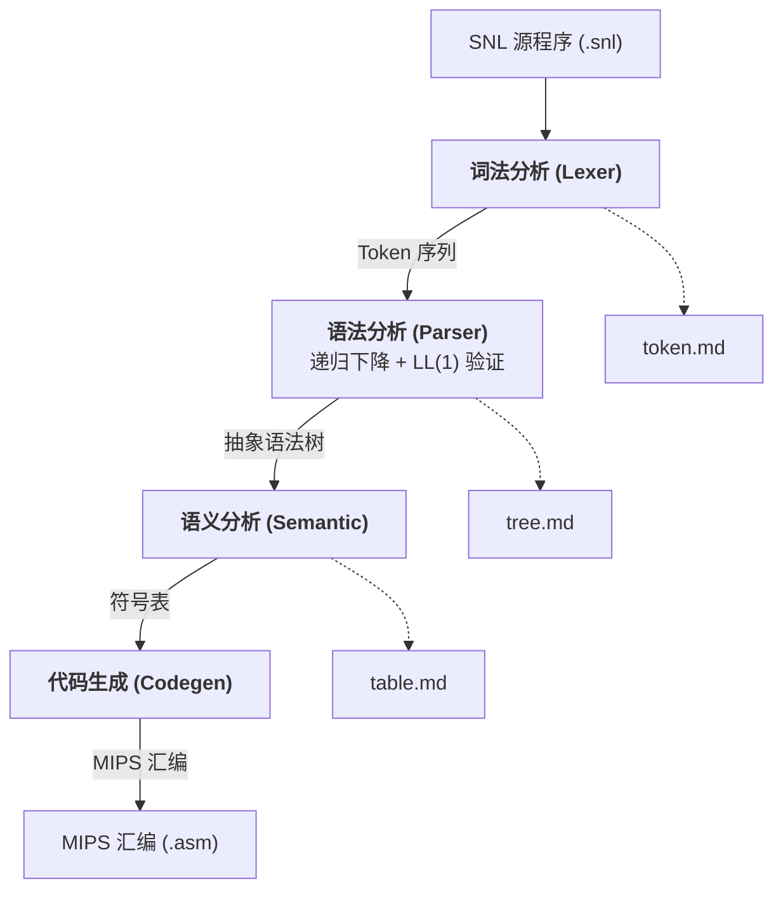
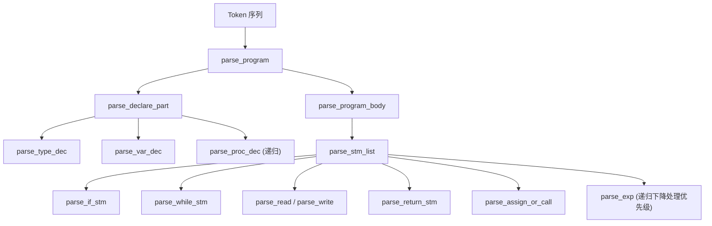
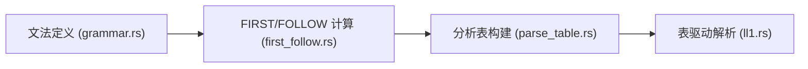
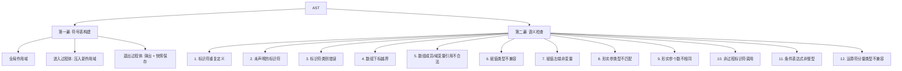
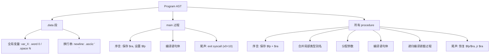

# SNL 编译器程序流程说明

> 本文档反映审计优化后的代码状态 (2026-05-28)

## 1. 整体架构



四个阶段均生成诊断输出 Markdown 文件，便于分步检查编译中间结果。

## 2. 主程序流程 (main.rs)

```mermaid
flowchart TD
    START([开始]) --> READ[读取 .snl 源文件]
    READ --> P1["阶段 1: 词法分析"]
    P1 --> P1_OUT[输出 token.md]
    P1_OUT --> P1_ERR{词法错误?}
    P1_ERR -->|是| EXIT1[打印错误并退出]
    P1_ERR -->|通过| P2["阶段 2: 递归下降语法分析"]
    P2 --> P2_OUT[输出 tree.md]
    P2_OUT --> P2_ERR{语法错误?}
    P2_ERR -->|是| PRINT[打印语法错误]
    P2_ERR -->|否| P25["阶段 2.5: LL(1) 文法验证"]
    PRINT --> P25
    P25 --> P25_ERR{文法冲突?}
    P25_ERR -->|是| EXIT_LL1[打印冲突并退出]
    P25_ERR -->|否| P25_WARN{验证错误?}
    P25_WARN -->|是| PRINT_WARN[打印 LL(1) 警告]
    P25_WARN -->|否| P3["阶段 3: 语义分析"]
    PRINT_WARN --> P3
    P3 --> P3_OUT[输出 table.md]
    P3_OUT --> P3_ERR{语义错误?}
    P3_ERR -->|是| EXIT2[打印错误并退出]
    P3_ERR -->|通过| P4["阶段 4: MIPS 代码生成"]
    P4 --> P4_ERR{代码生成错误?}
    P4_ERR -->|是| EXIT3[打印错误并退出]
    P4_ERR -->|通过| WRITE[写入 .asm 文件]
```

**关键改进**:
- LL(1) 验证作为**必需阶段**运行，文法冲突致命退出，验证不匹配产生警告
- 代码生成返回 `Result`，panic 已完全消除
- 所有错误报告使用统一的 `CompileError` 类型（含 `Display` 和 `Error` trait 实现）

## 3. 词法分析模块 (src/lexer/)

**输入**: SNL 源程序字符串
**输出**: Token 序列 + 词法错误列表


**DFA 状态转换**:

| 状态 | 触发字符 | 下一状态 | 说明 |
|------|---------|---------|------|
| Start | 字母 | InIdent | 标识符/关键字 |
| Start | 数字 | InNumber | 整型常量 |
| Start | `:` | InAssign | 赋值符 `:=` |
| Start | `.` | InRange | 范围符 `..` |
| Start | `{` | InComment | 注释 |
| Start | `'` | InChar | 字符常量 |
| Start | 其他 | Done | 单字符 Token |

**最长匹配策略**: DFA 持续读入直到遇到不能继续的字符，回溯到上一个接受状态。

**审计后的改进**:
- 关键字查找使用 `to_ascii_lowercase()`（原为 `to_lowercase()`），避免 Unicode 开销
- 孤立的 `:` 不再产生虚假的 `Assign` token（状态重置为 Start，返回 None）
- 整数溢出产生明确错误（`.expect()` 替代 `unwrap_or(0)`）
- 识别的 Token 种类: 21 个关键字、标识符、整型常量、字符常量、单/双字符分界符、EOF

## 4. 语法分析模块 (src/parser/)

### 4.1 递归下降分析器 (rd.rs)

**输入**: Token 序列
**输出**: 抽象语法树 (AST) + 语法错误信息



**表达式优先级** (由松到紧):


**审计后的改进**:
- `parse_proc_name`、`parse_invar`、`parse_variable` 返回 `Option`，空字符串不再进入 AST
- `parse_input_stm` 在 `parse_invar` 失败时调用 `sync()` 进行恐慌模式恢复
- 10 个尾递归 `_more` 函数全部转换为 `while` 循环（消除栈溢出风险）
- 三个重复的 ID 列表解析器合并为 `parse_id_list`

### 4.2 LL(1) 分析器 (ll1.rs)

**输入**: Token 序列
**输出**: LL(1) 语法错误信息



**审计后的改进**:
- LL(1) 验证已恢复为**生产编译必需阶段**（不再 `#[cfg(test)]`）
- 文法冲突 → `process::exit(1)`（编译器 bug）
- 验证不匹配 → 警告输出（RD 解析器已成功构建 AST）
- 错误恢复路径添加了边界检查（防止越界 panic）

## 5. 语义分析模块 (src/semantic/)

**输入**: 抽象语法树 (AST)
**输出**: 语义错误信息 + 符号表



**审计后的关键修复**:
- **错误 1 现正确触发**: 新增 `insert_symbol()` 方法，重复定义时调用 `self.error()`（此前被 `let _ =` 静默丢弃）
- **类型别名解析**: 新增 `resolve_type()` 方法递归展开 `Named` 类型；`types_compatible` 调用前自动解析
- **Record 多名字段**: `.flat_map()` 为每个字段名创建独立 `FieldInfo`（此前仅取 `first()`）
- **选择器解析**: `resolve_selector()` 现在正确处理 `TypeInfo::Named` 变体

## 6. 目标代码生成模块 (src/codegen/mips.rs)

### 6.1 类型系统

| 类型 | 分配大小 | 存取指令 | I/O 系统调用 |
|------|---------|---------|------------|
| `integer` | 4 字节 | `lw` / `sw` | read: 5, write: 1 |
| `char` | 4 字节 | `lb` / `sb` | read: 12, write: 11 |
| `array[lo..hi] of T` | (hi-lo+1) × elem_size | 下标计算 + `lw`/`sw`/`lb`/`sb` | — |
| `record ... end` | 字段大小之和 | 偏移量 + `lw`/`sw`/`lb`/`sb` | — |

**审计后的性能优化**:
- `get_var_type()`: 返回 `&CodegenType` 引用（原为克隆整个类型）
- `field_offset()`: 按需遍历查找（原为构建完整 HashMap）
- `fp_offset`: 内联到 emit 函数中（原为独立函数，每次调用分配 String）
- `mul`: 单指令 `mul $v0, $v0, $t0`（原为 `mul $t7, $v0, $t0; move $v0, $t7`）

### 6.2 总体流程



### 6.3 MIPS 栈帧布局

```
main 栈帧:
  $fp → [保存的 $ra]       0($fp)
         [局部变量...]      -4($fp), -8($fp), ...

procedure 栈帧:
  $fp → [保存的旧 $fp]     0($fp)
         [保存的 $ra]       4($fp)
         [局部变量...]      -8($fp), -12($fp), ...
         参数 (调用者压入)   8($fp) = 第一个参数
```

### 6.4 变量访问策略

| 变量层级 | 存储位置 | 访问方式 |
|---------|---------|---------|
| 全局变量 (level 0) | `.data` 段 | `la $t8, var_X` → `lw/sw/lb/sb $v0, 0($t8)` |
| 局部变量 (level > 0) | 栈上 `$fp` 相对 | `lw/sw/lb/sb $v0, offset($fp)` |

### 6.5 代码生成错误处理

审计后 `compile()` 返回 `Result<String, Vec<CompileError>>`，全部 10 处 `panic!()` 已消除：
- 6 处运行时 panic → `ctx.error(...)` + 安全默认值（`CodegenType::Integer`、偏移 0）
- 4 处类型转换 panic → `errors.push(CompileError::codegen(...))`
- 8 处 `unwrap()` → `.expect("... should never be empty")`
- 新增 `ErrorKind::Codegen` 错误变体

## 7. 数据流总览 (以 factorial 为例)

```
输入: "program factorial var integer result; ... begin ... end."
  │
  ▼
词法分析:
  program → TK::Program
  factorial → Ident
  var → TK::Var
  integer → TK::Integer
  ...
  │
  ▼ 输出 token.md
语法分析 (AST):
  Program { name: factorial
    decl: DeclarePart { vars: [result, n], procs: [fact] }
    body: StmList [Assign, Call, Write] }
  │
  ▼ LL(1) 验证 (文法冲突检查 + 表驱动解析)
  │   (静默通过，无冲突/验证错误)
  ▼ 输出 tree.md
语义分析:
  ✓ 符号表: result, n, fact(proc), m(param), temp(local)
  ✓ 类型检查通过
  ✓ 重复定义检测: 无重复
  │
  ▼ 输出 table.md
代码生成 (.asm):
  .data
  var_result: .word 0
  var_n: .word 0
  .text
  main:
    ...
    jal proc_fact
    ...
  proc_fact:
    addiu $sp, $sp, -8
    sw $fp, 0($sp)
    sw $ra, 4($sp)
    ...
```

## 8. 关键设计决策

### 8.1 `$fp` 被调用者保存

`$fp` 属于被调用者保存寄存器。过程序言保存旧的 `$fp`，尾声恢复，是支持嵌套/递归调用时参数正确寻址的关键。

### 8.2 全局变量放在 `.data` 段

全局变量在 `.data` 段声明为带标签的数据，通过 `la $t8, var_X` 访问。数组和记录使用 `.space N` 分配，添加 `.align 2` 确保字对齐。

### 8.3 `$v0` 作为表达式结果寄存器

所有表达式计算结果统一放在 `$v0` 中。乘法使用单指令 `mul $v0, $v0, $t0`。

### 8.4 类型信息从 AST 派生

代码生成器不依赖语义分析器的符号表，而是从 AST 声明节点直接推导类型信息。

### 8.5 `$t0` 保存/恢复

`emit_var_address` 使用 `$t0` 追踪运行时地址。表达式编译 (`compile_exp`) 的 Binary 分支也使用 `$t0`，因此在数组下标和字段下标的表达式求值前，必须将 `$t0` 压栈保存，求值后恢复。

### 8.6 LL(1) 验证作为必需阶段

LL(1) 表驱动解析器在编译管线中运行，文法冲突致命退出（编译器 bug），验证不匹配产生警告（RD 解析器已成功构建 AST）。`Ll1Parser` 使用 `&[Token]` 借用，零拷贝。
