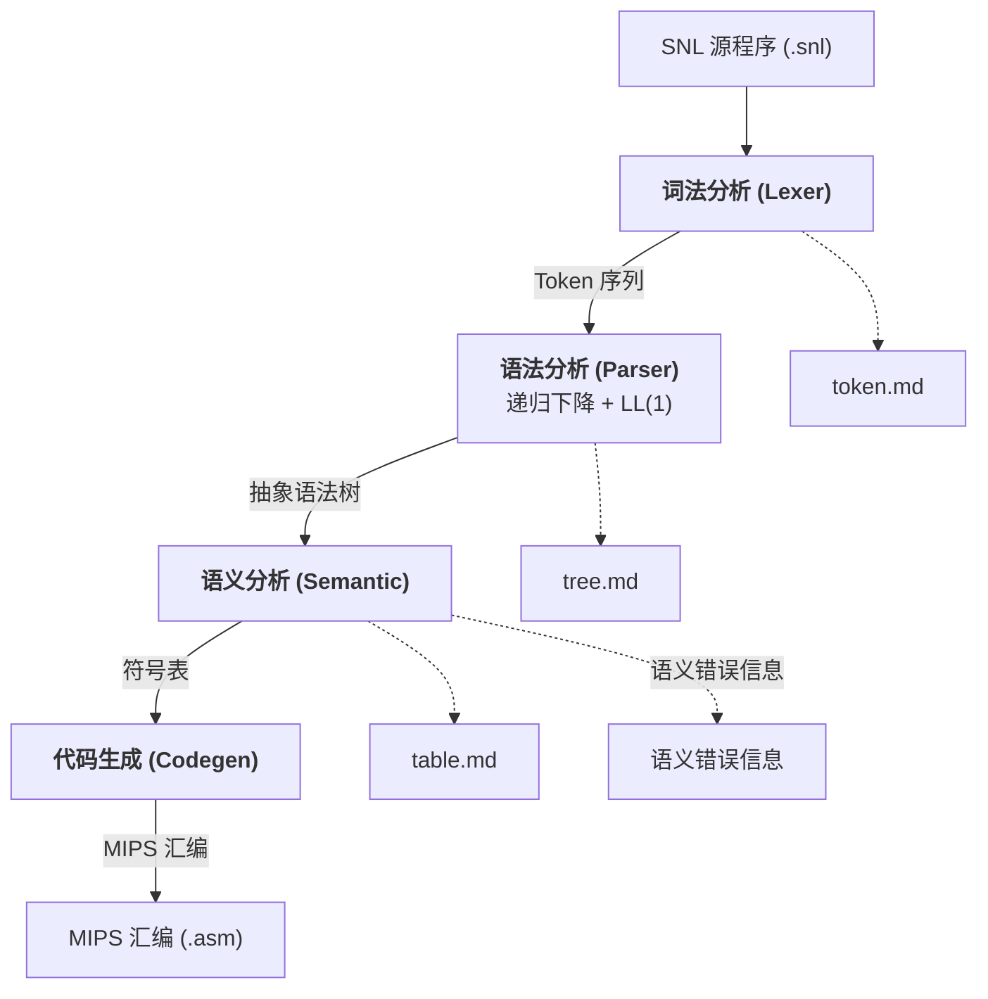
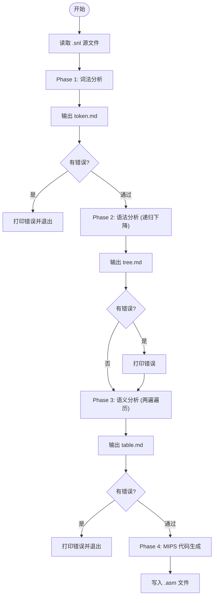
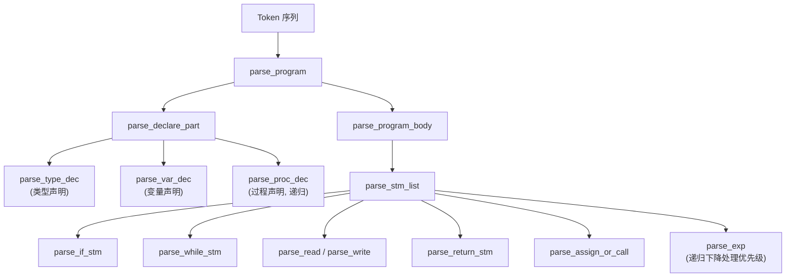
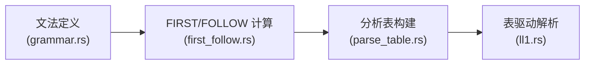
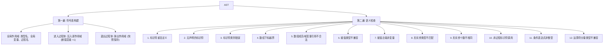
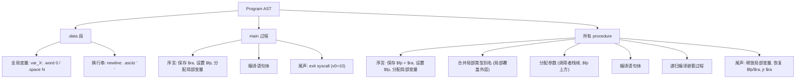
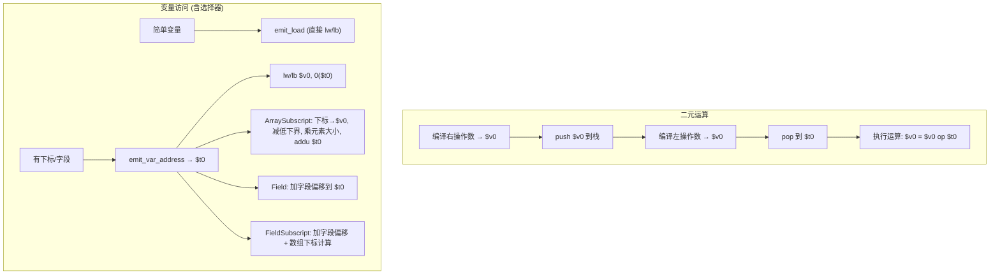
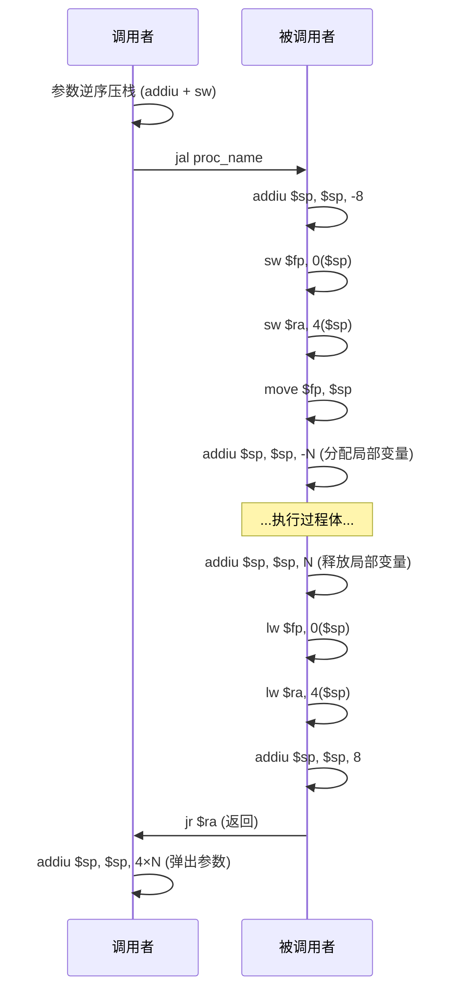

# SNL 编译器程序流程说明

## 1. 整体架构



四个阶段均生成诊断输出 Markdown 文件，便于分步检查编译中间结果。

## 2. 主程序流程 (main.rs)



## 3. 词法分析模块 (src/lexer/)

**输入**: SNL 源程序字符串
**输出**: Token 序列


**DFA 状态转换**:

| 状态 | 触发字符 | 下一状态 | 说明 |
|------|---------|---------|------|
| Start | 字母 | InIdent | 标识符/关键字 |
| Start | 数字 | InNumber | 整型常量 |
| Start | `:` | InAssign | 赋值符 `:=` |
| Start | `.` | InRange | 范围符 `..` |
| Start | `{` | InComment | 注释 |
| Start | `'` | InChar | 字符常量 |
| Start | 其他 | Done | 单字符 Token |

**最长匹配策略**: DFA 持续读入直到遇到不能继续的字符，回溯到上一个接受状态。

**识别的 Token 种类**: 21 个关键字、标识符、整型常量、字符常量、单/双字符分界符、EOF

## 4. 语法分析模块 (src/parser/)

### 4.1 递归下降分析器 (rd.rs)

**输入**: Token 序列
**输出**: 抽象语法树 (AST) + 语法错误信息



**表达式优先级** (由松到紧):


**恐慌模式错误恢复**: 遇到语法错误时跳过 Token 直到同步符号 (`;`, `end`, `fi`, `endwh`)

### 4.2 LL(1) 分析器 (ll1.rs)

**输入**: Token 序列
**输出**: 语法错误检查信息



**文法规模**: ~70 条产生式, 40+ 个非终结符

**左因子化**: `Stm → ID AssignRest` 与 `Stm → ID ( ActParamList )` 共用 `Ident` 前缀，引入 `AssCall` 非终结符消除冲突。

## 5. 语义分析模块 (src/semantic/)

**输入**: 抽象语法树 (AST)
**输出**: 语义错误信息 + 符号表

**两遍遍历**:



**作用域快照**: 每次 `exit_scope()` 前克隆当前作用域，保存到 `scope_snapshots` 列表中，用于诊断输出。

**词法作用域**: 查找标识符时从最内层作用域向外搜索。

## 6. 目标代码生成模块 (src/codegen/mips.rs)

### 6.1 类型系统

支持 SNL 全部四种数据类型:

| 类型 | 分配大小 | 存取指令 | I/O 系统调用 |
|------|---------|---------|------------|
| `integer` | 4 字节 | `lw` / `sw` | read: 5, write: 1 |
| `char` | 4 字节 | `lb` / `sb` | read: 12, write: 11 |
| `array[lo..hi] of T` | (hi-lo+1) × elem_size | 下标计算 + `lw`/`sw`/`lb`/`sb` | — |
| `record ... end` | 字段大小之和 | 偏移量 + `lw`/`sw`/`lb`/`sb` | — |

**关键实现**:
- `CodegenType`: 内部类型表示, 含 `size_of()`, `element_byte_size()`, `field_offsets()`
- `emit_var_address()`: 运行时计算 `VarAccess` (含数组下标和记录字段选择器) 地址到 `$t0`
- 类型别名通过 `build_type_alias_map()` 解析
- 数组元素大小: integer → `sll` 乘以 4, char → 不位移 (字节偏移)

### 6.2 总体流程



### 6.3 MIPS 栈帧布局

```
main 栈帧:
  $fp → [保存的 $ra]       0($fp)
         [局部变量...]      -4($fp), -8($fp), ...

procedure 栈帧:
  $fp → [保存的旧 $fp]     0($fp)
         [保存的 $ra]       4($fp)
         [局部变量...]      -8($fp), -12($fp), ...
         参数 (调用者压入)   8($fp) = 第一个参数
```

### 6.4 变量访问策略

| 变量层级 | 存储位置 | 访问方式 |
|---------|---------|---------|
| 全局变量 (level 0) | `.data` 段 | `la $t8, var_X` → `lw/sw/lb/sb $v0, 0($t8)` |
| 局部变量/参数 (level > 0) | 栈上 `$fp` 相对 | `lw/sw/lb/sb $v0, offset($fp)` |

### 6.5 表达式编译



结果约定: 表达式结果始终在 $v0 中

### 6.6 语句编译对照表

| SNL 语句 | MIPS 实现 |
|---------|----------|
| `x := exp` | 编译 RHS → $v0, 简单变量用 emit_store, 有选择器则保存 RHS → emit_var_address → 恢复 RHS → sw/sb |
| `if cond then A else B fi` | 编译 cond → slt/beq, `beqz` 跳 else, `j` 跳过 else |
| `while cond do body endwh` | loop 标签 + `beqz` 跳 endloop + `j loop` |
| `read(x)` | syscall: v0=5 (int) 或 v0=12 (char), 结果存入变量 |
| `write(exp)` | 编译 exp → $a0, syscall: v0=1 (int) 或 v0=11 (char), 加 v0=4 输出换行 |
| `return(exp)` | 编译 exp, 结果留在 $v0 |
| `proc(args)` | 参数逆序压栈, `jal proc_name`, 调用后弹栈 |

### 6.7 过程调用完整序列



## 7. 数据流总览 (以 factorial 为例)

```mermaid
flowchart TD
    INPUT['''输入: "Program factorial var integer result; ..."''']
    INPUT --> LEX["词法分析"]
    LEX --> LEX_OUT["program→TK::Program<br/>factorial→Ident<br/>var→TK::Var<br/>integer→TK::Integer<br/>..."]
    LEX --> TOKEN_MD["→ token.md"]
    LEX_OUT --> PARSE["语法分析 (AST)"]
    PARSE --> AST_OUT["Program { name: factorial<br/>  decl: DeclarePart { vars: [result, n], procs: [fact] }<br/>  body: StmList [Assign, Call, Write] }"]
    PARSE --> TREE_MD["→ tree.md"]
    AST_OUT --> SEM["语义分析"]
    SEM --> SEM_OUT["✓ 符号表: result(global), n(global), fact(proc, param=m), m(local), temp(local)<br/>✓ 类型检查通过"]
    SEM --> TABLE_MD["→ table.md"]
    SEM_OUT --> CG["代码生成 (.asm)"]
    CG --> ASM_OUT[".data / var_result: .word 0 / var_n: .word 0<br/>.text / main: ... jal proc_fact ...<br/>proc_fact: addiu $sp, $sp, -8 ..."]
```

## 8. 关键设计决策

### 8.1 `$fp` 被调用者保存

`$fp` (寄存器 `$30`/`$s8`) 属于被调用者保存寄存器。过程序言保存旧的 `$fp`，尾声恢复，是支持嵌套/递归调用时参数正确寻址的关键。

### 8.2 全局变量放在 `.data` 段

全局变量在 `.data` 段声明为带标签的数据，通过 `la $t8, var_X` 访问，避免了静态链 (static link) 的复杂实现。数组和记录使用 `.space N` 分配，且添加 `.align 2` 确保字对齐。

### 8.3 `$v0` 作为表达式结果寄存器

所有表达式计算结果统一放在 `$v0` 中。对于乘法运算，使用 `$t7` 作为中间目标寄存器 (`mul $t7, $v0, $t0; move $v0, $t7`)。

### 8.4 类型信息从 AST 派生

代码生成器不依赖语义分析器的符号表（其作用域在分析完成后已弹出），而是从 AST 声明节点直接推导类型信息，通过 `build_type_alias_map()` + `type_desig_to_codegen()` 解析。

### 8.5 `$t0` 保存/恢复

`emit_var_address` 使用 `$t0` 追踪运行时地址。由于表达式编译 (`compile_exp`) 的 Binary 分支也会使用 `$t0` 作为临时寄存器，在数组下标和记录字段下标的表达式求值前，必须将 `$t0` 压栈保存，求值后恢复。
