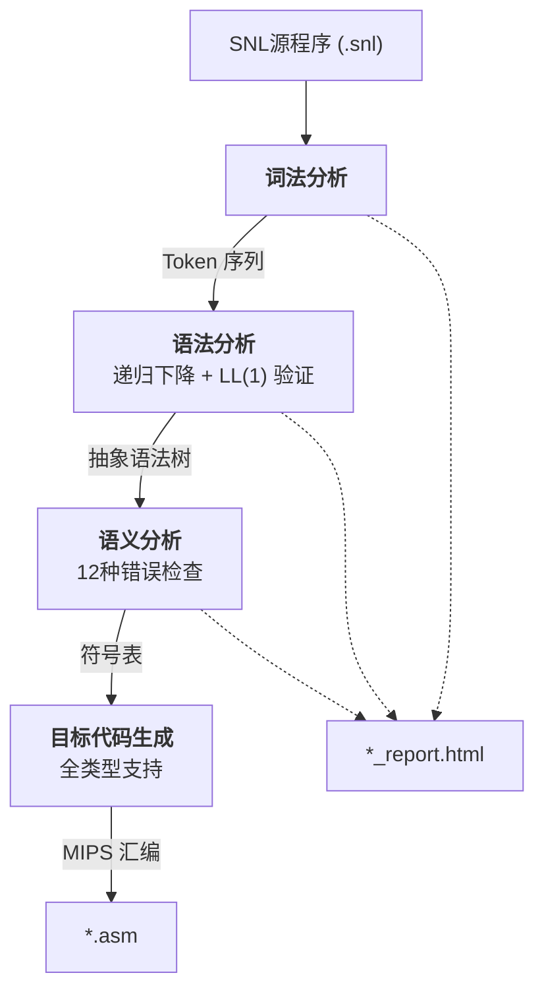

# SNL 编译器

## 项目简介

SNL（Small Nested Language）编译器基于 Rust 实现，将 SNL 源程序编译为 MIPS 汇编代码，可在 SPIM/MARS 模拟器上运行。涵盖编译原理课程的完整流程：词法分析 → 语法分析（递归下降 + LL(1) 验证）→ 语义分析 → 目标代码生成。

### SNL 语言特性

- **数据类型**：`integer`（整型）、`char`（字符型）、`array[lo..hi] of T`（数组）、`record ... end`（记录）
- **类型别名**：支持 `type Name = Type` 定义命名类型
- **控制结构**：`if/then/else/fi`、`while/do/endwh`
- **比较运算**：`<`（小于）、`=`（等于）
- **算术运算**：`+`、`-`、`*`、`/`
- **输入输出**：`read(x)` 读取、`write(x)` 输出
- **过程**：支持嵌套定义和递归调用，值参数

### SNL 示例程序

```pascal
program factorial
    var integer result;
        integer n;
    procedure fact(integer m);
        var integer temp;
    begin
        if m < 2
        then return(1)
        else
            temp := m - 1;
            fact(temp);
            return(m * result)
        fi
    end
begin
    n := 5;
    fact(n);
    write(result)
end.
```

---

## 编译流程



编译时会生成交互式 HTML 报告（`*_report.html`），包含 Token 列表、语法树浏览器和符号表的可视化展示，支持标签页切换、表格排序、全文搜索、语法树展开/折叠和匹配高亮。

### AST 语法树颜色编码

语法树节点根据语义类别使用不同颜色标识：

| 颜色 | CSS 类 | 匹配节点 | 语义类别 |
|------|--------|----------|----------|
| <span style="color:#6b8fdb">█</span> 钢蓝 `#6b8fdb` | `.tn-decl` | `ProK` `PheadK` `VarK` `TypeK` `ProcDecK` `DecK` | 声明 |
| <span style="color:#6ba87a">█</span> 翠绿 `#6ba87a` | `.tn-stmt` | `StmLk` `StmtK` | 语句 |
| <span style="color:#d96c7e">█</span> 珊瑚 `#d96c7e` | `.tn-expr` | `ExpK` | 表达式 |

---

## 项目结构

```
snl_compiler/
├── Cargo.toml
├── README.md
├── PROGRAM_FLOW.md          # 程序流程详细说明
├── explain.md               # 关键技术详解
├── 审计文档.md              # 代码审计与优化报告
├── samples/                 # 17 个 SNL 示例程序
│   ├── hello.snl
│   ├── arithmetic.snl
│   ├── control.snl
│   ├── factorial.snl
│   ├── fib.snl
│   ├── gcd.snl
│   ├── prime.snl
│   ├── power.snl
│   ├── sum.snl
│   ├── char_test.snl
│   ├── int_array.snl
│   ├── char_array.snl
│   ├── rec_test.snl
│   ├── rec_array.snl
│   ├── bubble.snl
│   ├── selection.snl
│   ├── insertion.snl
│   └── expected_output.md
└── src/
    ├── main.rs              # 程序入口，命令行接口
    ├── report.rs            # 自包含 HTML 诊断报告生成
    ├── lib.rs               # 模块导出
    ├── error.rs             # 统一错误类型定义
    ├── lexer/               # 词法分析
    │   ├── token.rs
    │   ├── keyword.rs
    │   ├── dfa.rs
    │   └── mod.rs
    ├── ast/                 # 抽象语法树
    │   ├── nodes.rs
    │   ├── display.rs
    │   └── mod.rs
    ├── parser/              # 语法分析
    │   ├── rd.rs            # 递归下降分析器（主解析器）
    │   ├── grammar.rs       # 文法产生式定义
    │   ├── first_follow.rs  # FIRST/FOLLOW 集计算
    │   ├── parse_table.rs   # LL(1) 分析表构建
    │   ├── ll1.rs           # 表驱动 LL(1) 分析器
    │   └── mod.rs
    ├── semantic/            # 语义分析
    │   ├── symbol.rs
    │   ├── analyzer.rs
    │   └── mod.rs
    └── codegen/             # 目标代码生成
        ├── mips.rs
        └── mod.rs
```

---

## 编译与运行

### 环境要求

- Rust 工具链 (1.85+)
- MIPS 模拟器 (可选): [SPIM](http://spimsimulator.sourceforge.net/) 或 [MARS](http://courses.missouristate.edu/KenVollmar/MARS/)

### 构建

```bash
cargo build              # debug 模式
cargo build --release    # release 模式
cargo test               # 全部 139 个测试
```

### 编译 SNL 程序

```bash
# 编译 hello.snl → hello.asm (同时生成交互式 HTML 报告 hello_report.html)
cargo run -- samples/hello.snl

# 指定输出文件名
cargo run -- samples/factorial.snl -o output.asm

# 批量编译 samples/ 下所有 SNL 样例
for f in samples/*.snl; do cargo run -- "$f"; done
```

### 运行生成的 MIPS 代码

```bash
spim -file samples/hello.asm
# 输出: 42
```

### 分模块测试

```bash
cargo test lexer       # 词法分析 (25 个用例)
cargo test parser      # 语法分析 (43 个用例)
cargo test semantic    # 语义分析 (22 个用例)
cargo test codegen     # 代码生成 (35 个用例)
cargo test --bin snl_compiler  # HTML 报告/入口 (14 个用例)
```

---

## 样例程序

| 类别 | 程序 | 输出 | 说明 |
|------|------|------|------|
| 基础 | `hello.snl` | `42` | 简单输出 |
| 基础 | `arithmetic.snl` | `10` `15` | 算术运算 |
| 基础 | `control.snl` | `11`... | 条件与循环 (死循环) |
| 算法 | `factorial.snl` | `120` | 递归阶乘 (5!) |
| 算法 | `fib.snl` | `55` | 斐波那契数列 |
| 算法 | `gcd.snl` | `6` | 最大公约数 |
| 算法 | `prime.snl` | `1` | 素数判定 |
| 算法 | `power.snl` | `256` | 幂运算 (2^8) |
| 算法 | `sum.snl` | `55` | 等差数列求和 |
| 类型 | `char_test.snl` | `A` `B` | char 变量赋值/输出 |
| 类型 | `int_array.snl` | `2` `6` `10` | 整型数组下标访问 |
| 类型 | `char_array.snl` | `H` `e` `l` `l` `o` | 字符数组 |
| 类型 | `rec_test.snl` | `100` `X` | 记录 (int + char) |
| 类型 | `rec_array.snl` | `0` `20` `40` `5` | 记录含数组字段 |
| 排序 | `bubble.snl` | `12` `22` `25` `34` `64` | 冒泡排序 |
| 排序 | `selection.snl` | `12` `22` `25` `34` `64` | 选择排序 |
| 排序 | `insertion.snl` | `12` `22` `25` `34` `64` | 插入排序 |

---

## 错误处理

```
=== Lexical Errors ===
  Line 3:1 — Unterminated comment

=== Syntax Errors ===
  Line 5:10 — Expected ;, found Ident("v2")

=== LL(1) Verification Errors ===
  Line 5:10 — LL(1): Expected Semicolon, found Ident("v2")
Warning: LL(1) verification failed (RD parse succeeded)

=== Semantic Errors ===
  Line 10:5 — Undeclared identifier 'z'

=== Codegen Errors ===
  [codegen] Unknown variable 'x'
```

| 错误阶段 | 处理策略 |
|---------|---------|
| 词法错误 | 立即退出（后续阶段无法处理） |
| 语法错误 | 收集但不阻止（AST 可能不完整，继续语义分析） |
| LL(1) 验证 | 文法冲突致命退出；验证不匹配仅警告（RD 已成功构建 AST） |
| 语义错误 | 收集后退出（代码生成需要正确类型信息） |
| 代码生成错误 | 收集后退出（汇编代码不完整） |

---

## 审计与优化

本项目经过全面代码审计（2026-05），共发现 120+ 个问题，修复 22 个关键问题：

| 类别 | 修复 | 关键项 |
|------|------|--------|
| **严重缺陷** | 7 | 重复定义检测、类型别名解析、Record 多名字段、孤 `:` Token、整数溢出 |
| **性能优化** | 7 | 引用返回、按需查找、内联优化、ASCII 转换、借用代替克隆 |
| **安全性** | 3 | 尾递归→循环、panic→CompileError、unwrap→expect |
| **代码质量** | 5 | Option 返回类型、Display/Error 实现、ID 列表去重、LL(1) 恢复 |

全部 17 个样例程序已批量编译通过，139 个测试通过。

详细报告：**`审计文档.md`**。
