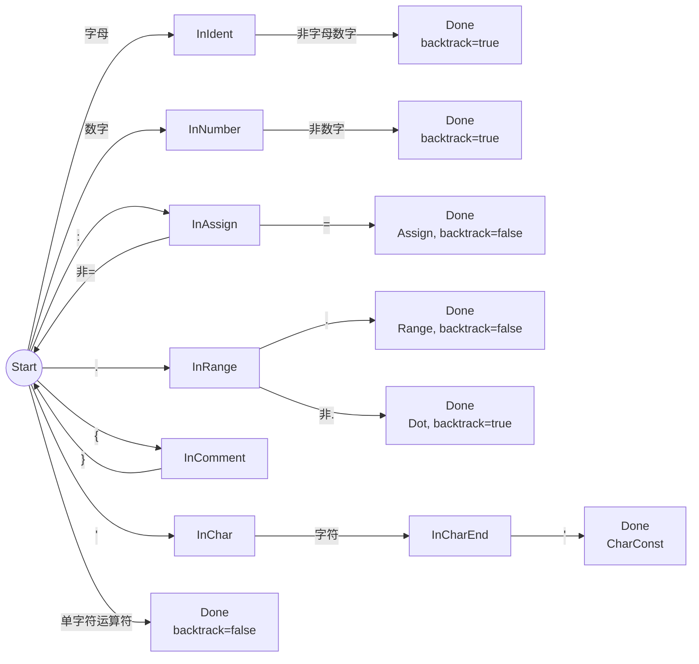

# SNL 编译器关键技术详解

> 本文档反映审计优化后的代码状态 (2026-05-28)

## 目录

- [1. 词法分析模块](#1-词法分析模块)
- [2. 语法分析模块](#2-语法分析模块)
- [3. 语义分析模块](#3-语义分析模块)
- [4. 代码生成模块](#4-代码生成模块)
- [5. 主程序与诊断输出](#5-主程序与诊断输出)

---

## 1. 词法分析模块

### 1.1 架构概述

词法分析器位于 `src/lexer/`，由四个文件组成：

| 文件 | 职责 |
|------|------|
| `token.rs` | Token 类型定义 |
| `keyword.rs` | 关键字二分查找表 |
| `dfa.rs` | DFA 状态机 |
| `mod.rs` | Lexer 驱动与主扫描循环 |

### 1.2 TokenKind 枚举

`TokenKind` 共 29 个变体：

**关键字（21 个）：** `Program`, `Type`, `Var`, `Procedure`, `Begin`, `End`, `Integer`, `Char`, `Array`, `Record`, `Of`, `While`, `Do`, `EndWh`, `If`, `Then`, `Else`, `Fi`, `Return`, `Read`, `Write`

**多字符运算符（2 个）：** `Assign` (`:=`), `Range` (`..`)

**单字符运算符与分隔符（13 个）：** `Plus`, `Minus`, `Times`, `Divide`, `LParent`, `RParent`, `LBracket`, `RBracket`, `Semicolon`, `Dot`, `Comma`, `Less`, `Equal`

**字面量（3 个，携带数据）：** `Ident(String)`, `IntConst(i64)`, `CharConst(char)`

**特殊（1 个）：** `Eof`

### 1.3 DFA 状态机

DFA 使用 **最长匹配策略**，通过回溯实现单字符前瞻。核心状态：



**关键实现 —— `backtrack` 标志：**

```rust
// dfa.rs - DfaResult 结构体
struct DfaResult {
    kind: TokenKind,
    line: usize,
    col: usize,
    backtrack: bool,  // 核心: 当前字符是否属于下一单词
}
```

当 DFA 遇到不属于当前词素的终止字符时（如数字后跟非数字），设置 `backtrack: true`，主循环不会前进字符索引，因此该字符将作为下一个 Token 的起始重新扫描。对于双字符运算符（`:=`, `..`），第二个字符被消费，设置 `backtrack: false`。

### 1.4 关键字查找

```rust
// keyword.rs
const KEYWORDS: &[(&str, TokenKind)] = &[
    ("array",    TokenKind::Array),
    ("begin",    TokenKind::Begin),
    // ... 共 21 个，按字母排序 ...
    ("write",    TokenKind::Write),
];

pub fn lookup_keyword(ident: &str) -> TokenKind {
    let lower = ident.to_ascii_lowercase();  // 审计优化: to_ascii_lowercase
    KEYWORDS
        .binary_search_by(|(kw, _)| kw.cmp(&lower.as_str()))
        .map(|i| KEYWORDS[i].1.clone())
        .unwrap_or_else(|_| TokenKind::Ident(ident.to_string()))
}
```

**要点：**
- 二分查找，O(log 21) ≈ 常数时间
- 使用 `to_ascii_lowercase()`（非 `to_lowercase()`），避免 Unicode 处理开销
- 未命中时返回 `Ident`，保留原始大小写

### 1.5 边界情况处理

| 情况 | 处理方式 |
|------|---------|
| 单独的 `:` 不构成 `:=` | 状态重置为 Start，返回 None，正确丢弃（**已修复**） |
| `'ab'` 内多字符 | 只取首字符生成 CharConst，多余字符回溯重扫 |
| 未闭合的 `'` | EOF 时报告 "Unterminated character literal" |
| 未闭合的 `{` | EOF 时报告 "Unterminated comment" |
| 多行注释 | DFA 内追踪换行以保持行号 |
| 下划线 `_` | 不属于标识符字符集，被当作分隔符 |
| 整数溢出 | `.expect("integer literal parse failed")` 明确报错（**已修复**） |

---

## 2. 语法分析模块

### 2.1 架构概述

项目实现**两套**语法分析器，在编译管线中协同工作：

| 分析器 | 文件 | 功能 |
|--------|------|------|
| 递归下降 (RD) | `rd.rs` | **构建完整 AST**，恐慌模式错误恢复 |
| LL(1) 表驱动 | `ll1.rs` + `grammar.rs` + `first_follow.rs` + `parse_table.rs` | **接受/拒绝验证**，作为编译必需阶段运行 |

两者共享 `grammar.rs` 中定义的文法。LL(1) 验证在 RD 解析成功后运行，文法冲突致命退出，验证不匹配产生警告。

### 2.2 递归下降分析器 —— 表达式优先级爬升

运算符优先级通过**函数调用层次**编码：

```rust
// rd.rs - 表达式优先级: RelExp > Exp > Term > Factor
fn parse_rel_exp(&mut self) -> Exp { /* 处理 < 和 = */ }
fn parse_exp(&mut self) -> Exp { /* 处理 + 和 - */ }
fn parse_term(&mut self) -> Exp { /* 处理 * 和 / */ }
fn parse_factor(&mut self) -> Exp { /* 处理常量、变量、括号 */ }
```

### 2.3 恐慌模式错误恢复

```rust
// rd.rs - sync 函数
fn sync(&mut self, sync_tokens: &[TokenKind]) {
    while !sync_tokens.contains(self.peek_kind())
          && !matches!(self.peek_kind(), TokenKind::Eof)
    {
        self.pos += 1;
    }
}
```

`parse_input_stm` 在 `parse_invar()` 返回 `None` 时调用 `sync(&[RParent, Semicolon, End, Eof])` 确保解析器到达安全状态。

### 2.4 错误恢复改进（审计）

三个解析函数从返回 `String` 改为返回 `Option`，空字符串不再进入 AST：

```rust
// parse_proc_name: Option<String> — 失败时 early return
// parse_invar: Option<String> — 失败时 sync() + 空 fallback
// parse_variable: Option<VarAccess> — 失败时 IntConst(0) fallback
```

### 2.5 尾递归消除

10 个 `_more` 函数由尾递归改为 `while` 循环（消除栈溢出风险）：

```rust
// 之前: 尾递归
fn parse_id_more(&mut self, names: &mut Vec<String>) {
    if condition { ...; self.parse_id_more(names); }
}

// 之后: while 循环
fn parse_id_more(&mut self, names: &mut Vec<String>) {
    while condition { ... }
}
```

受影响的函数: `parse_id_more`, `parse_var_id_more`, `parse_fid_more`, `parse_param_more`, `parse_stm_more`, `parse_act_param_more`, `parse_type_dec_more`, `parse_field_dec_more`, `parse_var_dec_more`, `parse_proc_dec_more`

三个重复的 ID 列表解析器（`parse_id_list`/`parse_var_id_list`/`parse_form_list`）已合并为 `parse_id_list`。

### 2.6 LL(1) 分析器 —— FIRST/FOLLOW 不动点计算

标准不动点迭代算法，对 SNL 的 ~70 条产生式、46 个非终结符计算 FIRST/FOLLOW 集。

### 2.7 LL(1) 分析表构建与冲突检测

构建预测分析表，冲突检测在构造时完成（`Ll1Parser::new()` 返回 `Result`）。

### 2.8 LL(1) 表驱动解析

```rust
// ll1.rs - 审计后: 错误恢复添加了边界检查
if self.pos + 1 < self.tokens.len() {
    self.pos += 1;
}
```

`Ll1Parser` 使用 `tokens: &'a [Token]` 借用，零拷贝（审计优化）。文法规模 ~70 条产生式, 40+ 个非终结符。

---

## 3. 语义分析模块

### 3.1 符号表 —— 嵌套作用域栈

```rust
// symbol.rs
pub struct SymbolTable {
    scopes: Vec<HashMap<String, SymbolEntry>>,
}
```

作用域通过 `Vec` 管理，索引 0 为全局作用域：
- `enter_scope()`: `scopes.push(HashMap::new())`
- `exit_scope()`: `scopes.pop()`
- `lookup(name)`: `scopes.iter().rev()` 从内向外查找

**重复定义检测（审计修复）**:

```rust
// analyzer.rs - insert_symbol 辅助方法
fn insert_symbol(&mut self, entry: SymbolEntry) {
    let name = entry.name.clone();
    let loc = entry.loc;
    if self.symbols.insert(entry).is_err() {
        self.error(SemanticErrCode::DuplicateId,
            format!("Duplicate definition of '{}'", name), loc);
    }
}
```

此前所有调用点使用 `let _ = self.symbols.insert(...)` 静默丢弃错误，`DuplicateId` 从未被触发。

### 3.2 TypeInfo —— 内部类型表示

```rust
pub enum TypeInfo {
    Integer,                               // 整型
    Char,                                  // 字符型
    Array(Box<TypeInfo>, i64, i64),        // 数组
    Record(Vec<FieldInfo>),                // 记录
    Named(String),                         // 命名类型别名
}
```

### 3.3 类型别名解析（审计新增，含循环检测）

```rust
// analyzer.rs - resolve_type 方法（已添加循环检测）
fn resolve_type(&self, ty: &TypeInfo, visited: &mut Vec<String>) -> TypeInfo {
    match ty {
        TypeInfo::Named(name) => {
            // 循环检测：防止 type A = B; type B = A 导致栈溢出
            if visited.contains(name) {
                self.error(SemanticErrCode::CircularTypeAlias,
                    format!("Circular type alias '{}'", name), loc);
                return ty.clone();
            }
            match self.symbols.lookup(name) {
                Some(entry) if entry.kind == IdKind::TypeId => {
                    if let Some(inner) = &entry.typ {
                        visited.push(name.clone());
                        let resolved = self.resolve_type(inner, visited);
                        visited.pop();
                        return resolved;
                    }
                }
                _ => {}
            }
            ty.clone()
        }
        TypeInfo::Array(elem, low, high) => {
            TypeInfo::Array(Box::new(self.resolve_type(elem, visited)), *low, *high)
        }
        _ => ty.clone(),
    }
}
```

在 `check_assign`、`check_exp`（二元运算）、`check_call`（过程调用实参）三处，调用 `types_compatible` 之前自动调用 `resolve_type()` 解析命名类型。为防止循环类型别名导致栈溢出，新增 `visited: &mut Vec<String>` 参数追踪解析链，检测到循环时报告 `CircularTypeAlias` 错误。

### 3.4 类型兼容性检查

```rust
fn types_compatible(a: &TypeInfo, b: &TypeInfo) -> bool {
    match (a, b) {
        (TypeInfo::Integer, TypeInfo::Integer) => true,
        (TypeInfo::Char, TypeInfo::Char) => true,
        (TypeInfo::Array(e1, l1, h1), TypeInfo::Array(e2, l2, h2)) =>
            l1 == l2 && h1 == h2 && types_compatible(e1, e2),
        (TypeInfo::Record(f1), TypeInfo::Record(f2)) =>
            f1.len() == f2.len()
                && f1.iter().zip(f2.iter())
                     .all(|(a, b)| a.name == b.name && types_compatible(&a.typ, &b.typ)),
        (TypeInfo::Named(n1), TypeInfo::Named(n2)) => n1 == n2,
        _ => false,
    }
}
```

注意：调用方在传入 `types_compatible` 之前已通过 `resolve_type()` 展开 `Named` 类型，因此 `(Named, Integer)` 的组合已被解析为 `(Integer, Integer)`。

### 3.5 Record 多名字段修复

```rust
// analyzer.rs - 审计前: .map(|f| f.names.first().cloned().unwrap_or_default())
// 审计后: .flat_map(|f| f.names.iter().map(move |n| FieldInfo { name: n.clone(), typ: ft.clone() }))
```

当字段定义包含多个名字（如 `record integer x, y; end`）时，现在为每个名字创建独立的 `FieldInfo` 条目。

### 3.6 12 种语义错误

| 代码 | 枚举变体 | 触发条件 |
|------|---------|---------|
| 1 | `DuplicateId` | 同一作用域内重复声明（**现已正确触发**） |
| 2 | `UndeclaredId` | 使用未声明标识符 |
| 3 | `WrongIdKind` | 将类型名当变量/过程用 |
| 4 | `ArraySubscriptRange` | 数组常量下标越界 |
| 5 | `InvalidArrayOrFieldRef` | 对非数组用下标、对非记录用 `.` |
| 6 | `AssignTypeMismatch` | 赋值左右类型不兼容 |
| 7 | `AssignLhsNotVariable` | 对非变量赋值 |
| 8 | `ParamTypeMismatch` | 过程调用实参类型错误 |
| 9 | `ParamCountMismatch` | 过程调用参数数量错误 |
| 10 | `NotProcedure` | 调用非过程标识符 |
| 11 | `CondNotBool` | if/while 条件非整型 |
| 12 | `OperatorTypeMismatch` | 表达式运算符类型不匹配 |

---

## 4. 代码生成模块

### 4.1 CodegenType —— 代码生成内部类型

```rust
pub enum CodegenType {
    Integer,                              // 4 字节, lw/sw
    Char,                                 // 4 字节分配, lb/sb
    Array(Box<CodegenType>, i64, i64),    // count × elem_byte_size
    Record(Vec<(String, CodegenType)>),   // 扁平化字段列表
}
```

**审计改进**: `field_offsets()` → `field_offset()` 按需查找

```rust
// 审计后: 按需查找，零 HashMap 分配
fn field_offset(&self, name: &str) -> Option<(i32, CodegenType)> {
    if let CodegenType::Record(fields) = self {
        let mut offset = 0i32;
        for (fname, ft) in fields {
            if fname == name { return Some((offset, ft.clone())); }
            offset += ft.size_of();
        }
    }
    None
}
```

### 4.2 类型别名解析

代码生成器从 AST 直接推导类型，不依赖语义分析器。**审计改进**：`type_desig_to_codegen` 和 `type_body_to_codegen` 现在接收 `errors: &mut Vec<CompileError>` 参数，替换了原来的 `panic!` 和 `eprintln!`。

```rust
fn type_desig_to_codegen(
    td: &TypeDesig,
    aliases: &HashMap<String, TypeBody>,
    errors: &mut Vec<CompileError>,
) -> CodegenType { /* ... */ }
```

### 4.3 MipsContext —— 作用域感知状态

```rust
pub struct MipsContext {
    pub code: String,
    pub data: String,
    label_counter: usize,
    var_offsets: Vec<HashMap<String, (i32, usize)>>,
    var_types: Vec<HashMap<String, CodegenType>>,
    frame_sizes: Vec<i32>,
    nesting_level: usize,
    errors: Vec<CompileError>,       // 审计新增: 错误收集
}
```

**错误报告方法**:
```rust
fn error(&mut self, msg: impl Into<String>) {
    self.errors.push(CompileError::codegen(msg));
}
```

### 4.4 类型感知加载/存储

```rust
fn emit_load(ctx: &mut MipsContext, offset: i32, var_level: usize,
             name: &str, typ: &CodegenType) {
    let instr = if matches!(typ, CodegenType::Char) { "lb" } else { "lw" };
    // ... 全局用 la $t8, 局部用 $fp 偏移 (fp_offset 已内联)
}
```

**审计改进**: `get_var_type()` 返回 `&CodegenType` 引用（原为克隆），`fp_offset` 内联到 emit 函数中。

### 4.5 表达式编译

```rust
fn compile_exp(exp: &Exp, ctx: &mut MipsContext) -> CodegenType {
    match exp {
        Exp::Binary { op, left, right, .. } => {
            // 先右后左，中间值压栈
            compile_exp(right, ctx);
            ctx.emit("  addiu $sp, $sp, -4");
            ctx.emit("  sw $v0, 0($sp)");
            compile_exp(left, ctx);
            ctx.emit("  lw $t0, 0($sp)");
            ctx.emit("  addiu $sp, $sp, 4");
            match op {
                BinOp::Add => ctx.emit("  addu $v0, $v0, $t0"),
                BinOp::Sub => ctx.emit("  subu $v0, $v0, $t0"),
                BinOp::Mul => ctx.emit("  mul $v0, $v0, $t0"),  // 审计: 单指令
                // ...
            }
            CodegenType::Integer
        }
        // ...
    }
}
```

**审计改进**: `mul` 改为单指令 `mul $v0, $v0, $t0`（原为 `mul $t7, $v0, $t0; move $v0, $t7`）。

### 4.6 语句编译

**Read（类型感知 I/O）**:
```rust
Stm::Read { var, .. } => {
    let is_char = ctx.get_var_type(var)
        .map_or(false, |t| matches!(t, CodegenType::Char));
    if is_char {
        ctx.emit("  li $v0, 12             # read char syscall");
    } else {
        ctx.emit("  li $v0, 5              # read int syscall");
    }
    ctx.emit("  syscall");
    // ...
}
```

**If/While**:
```rust
// If: beqz 跳 else, j 跳过 else 块
Stm::If { cond, then_branch, else_branch, .. } => {
    let else_label = ctx.new_label("else");
    let end_label = ctx.new_label("endif");
    compile_exp(cond, ctx);
    ctx.emit(&format!("  beqz $v0, {}", else_label));
    compile_stm_list(&then_branch.stmts, ctx);
    ctx.emit(&format!("  j {}", end_label));
    ctx.emit_label(&else_label);
    compile_stm_list(&else_branch.stmts, ctx);
    ctx.emit_label(&end_label);
}
```

### 4.7 过程调用序列

```
调用者:
  参数逆序压栈 (addiu + sw)
  jal proc_name
  addiu $sp, $sp, 4×N (弹出参数)

被调用者:
  addiu $sp, $sp, -8         # $fp + $ra 空间
  sw $fp, 0($sp)
  sw $ra, 4($sp)
  move $fp, $sp
  addiu $sp, $sp, -N          # 分配局部变量
  ... 过程体 ...
  addiu $sp, $sp, N           # 释放局部变量
  lw $fp, 0($sp)
  lw $ra, 4($sp)
  addiu $sp, $sp, 8
  jr $ra
```

### 4.8 错误处理（审计改进）

`compile()` 返回 `Result<String, Vec<CompileError>>`:

```rust
pub fn compile(prog: &Program) -> Result<String, Vec<CompileError>> {
    let mut ctx = MipsContext::new();
    // ... 编译过程 ...
    if ctx.errors.is_empty() {
        Ok(format!(".data\n{}\n.text\n.globl main\n{}", ctx.data, ctx.code))
    } else {
        Err(ctx.errors)
    }
}
```

全部 10 处 `panic!()` 已消除，8 处 `unwrap()` 转换为 `.expect()`。新增 `ErrorKind::Codegen` 错误变体。

---

## 5. 主程序与诊断输出

### 5.1 编译流水线

```rust
// src/main.rs - 五阶段流水线（含 LL(1) 验证）
fn main() {
    // 阶段 1: 词法分析（诊断 → _report.html）
    let (tokens, lex_errors) = lexer.tokenize(&source);
    if !lex_errors.is_empty() { process::exit(1); }

    // 阶段 2: 递归下降语法分析（诊断 → _report.html）
    let prog = parser.parse()?;

    // 阶段 2.5: LL(1) 文法验证
    match Ll1Parser::new() {
        Ok(mut ll1) => {
            if !ll1.parse(tokens) {
                eprintln!("=== LL(1) Verification Errors ===");
                // 警告: RD 已成功构建 AST
            }
        }
        Err(conflicts) => {
            eprintln!("=== LL(1) Grammar Conflicts ===");
            process::exit(1);
        }
    }

    // 阶段 3: 语义分析（诊断 → _report.html）
    analyzer.analyze(&prog);
    if !semantic_errors.is_empty() { process::exit(1); }

    // 阶段 4: MIPS 代码生成 → .asm
    let asm = match mips::compile(&prog) {
        Ok(asm) => asm,
        Err(errors) => { /* 打印并退出 */ }
    };
    fs::write(&output_path, &asm)?;
}
```

### 5.2 诊断输出文件

| 文件 | 内容 | 生成阶段 |
|------|------|---------|
| `*_report.html` | 自包含 HTML 报告（含 Token 序列、AST、符号表、错误信息，支持标签页切换与搜索） | 全部阶段完成后 |
| `*.asm` | MIPS 汇编代码 | 代码生成后 |

### 5.3 错误处理策略

| 错误阶段 | 策略 |
|---------|------|
| 词法错误 | 收集后立即退出 |
| 语法错误 | 收集但不阻止语义分析 |
| LL(1) 验证 | 文法冲突 → `exit(1)`；验证不匹配 → 警告 |
| 语义错误 | 收集后退出 |
| 代码生成错误 | 收集后退出（`compile()` 返回 `Result`） |

所有错误均通过 `CompileError` 统一表示，支持 `Debug`、`Display` 和 `std::error::Error` trait。

### 5.4 审计改进总结

| 类别 | 数量 | 关键修复 |
|------|------|---------|
| 严重缺陷 | 4 | 重复定义检测、类型别名解析、选择器 Named 处理、Record 多名字段 |
| 词法/语法 Bug | 2 | 孤立 `:` Token、整数溢出 |
| 性能优化 | 7 | 引用返回、按需查找、内联、ASCII 转换、借用、mul 优化、Clone 移除 |
| 安全性 | 2 | 尾递归→循环、panic→CompileError |
| 代码质量 | 5 | Option 返回、Display/Error、ID 列表去重、unwrap→expect、LL(1) 边界检查 |
