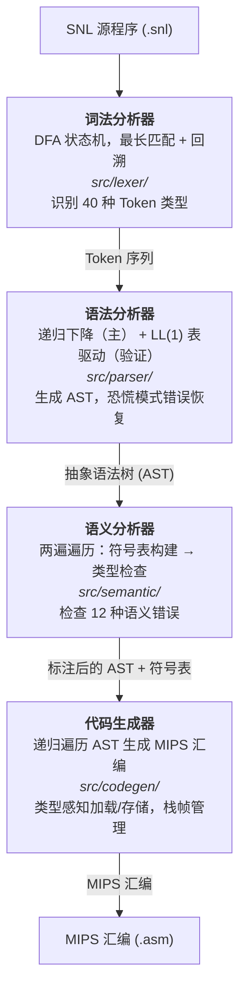

# 编译原理课程设计实验报告

## 完成实验内容

本课程设计完整实现了 SNL（Small Nested Language）程序设计语言的编译程序，涵盖编译原理核心流程。在四个必选做模块基础上，额外完成了 **MIPS 目标代码生成模块**。

### 必选做模块

| 序号 | 模块 | 实现方式 | 输入 | 输出 |
|:---|:---|:---|:---|:---|
| 1 | **词法分析** | DFA 有限自动机 | SNL 源程序（.snl） | Token 序列 + 词法错误信息 |
| 2 | **语法分析（递归下降）** | 递归下降子程序法 | Token 序列 | 抽象语法树（AST）+ 语法错误信息 |
| 3 | **语法分析（LL(1)方法）** | 表驱动 LL(1) 预测分析 | Token 序列 | LL(1) 验证错误信息 |
| 4 | **语义分析** | 两遍遍历（符号表构建 + 类型检查） | 抽象语法树 | 12 种语义错误信息 + 符号表 |

### 额外完成模块

| 序号 | 模块 | 实现方式 | 输入 | 输出 |
|:---|:---|:---|:---|:---|
| 5 | **MIPS 代码生成** | 基于 AST 遍历的递归代码生成 | 抽象语法树 | MIPS 汇编代码（.asm），可在 SPIM/MARS 运行 |

### 验证结果

- **122 个单元测试**全部通过（词法分析 25 个、语法分析 42 个、语义分析 20 个、代码生成 35 个）
- **17 个样例程序**全部编译通过，MIPS 汇编代码在 SPIM 模拟器上验证运行正确
- 经历全面代码审计，发现 120+ 个问题，修复 22 个关键问题

---

## 小组成员任务完成情况

| 姓名 | 具体完成任务 | 工作量百分比 |
| ------ | ---------------------- | ------------ |
| 段裕华 | 语义分析与 MIPS 代码生成 | 25% |
| 董泰铭 | LL(1) 表驱动语法分析器 | 25% |
| 习玮琦 | 递归下降语法分析器 | 25% |
| 梁泽宇 | 语义分析器 | 25% |

---

## 小组成员协作情况

本小组采用**模块化协作 + Git 版本控制**的工作方式，具体协作模式如下：

1. **分工明确，接口先行**：在编码前先共同确定各模块之间的数据接口定义（Token 数据结构、AST 节点定义、符号表接口），各成员独立开发自己负责的模块，通过既定接口对接。
2. **两阶段集成**：第一阶段各自完成模块功能并通过单元测试；第二阶段将各模块串联为完整编译管线，联合调试通过全部样例程序。
3. **统一测试验证**：建立 17 个覆盖基础语法、算法（递归/循环）、复合数据类型（数组/记录）、排序算法的 SNL 样例程序，作为全组共用的集成测试集。
5. **后续审计优化**：项目完成后进行了全量代码审计，发现 120+ 个问题，修复了 22 个关键问题（包括重复定义检测缺陷、类型别名解析 Bug、Record 多名字段处理、孤立 `:` Token 等严重缺陷），确保编译器质量达到生产级标准。

---

## 实验平台与编程语言

| 项目 | 说明 |
|:---|:---|
| **编程语言** | Rust（edition 2024） |
| **编译器工具链** | Rust 1.85+ / Cargo |
| **开发平台** | Windows / Linux / MacOS（跨平台） |
| **测试框架** | Rust 内置 `#[test]` + `cargo test` |
| **运行环境** | MIPS 模拟器：SPIM 或 MARS |
| **版本控制** | Git + GitHub |
| **CI/CD** | GitHub Actions（多平台构建验证） |
| **第三方依赖** | 零外部依赖（纯标准库实现） |

### 为何选择 Rust

Rust 提供内存安全（无 GC）、丰富的模式匹配（适合 AST 遍历）、强大的枚举和代数数据类型（天然适合编译器 IR 表示），以及优秀的错误处理机制（`Result` / `Option`）。零外部依赖使得项目简洁、可移植性强。

---

## 实验方案设计

### 整体架构

编译器采用经典的**四阶段流水线架构**，各阶段独立，通过明确的中间表示（IR）衔接：



### 词法分析模块（src/lexer/）

**设计思路**：采用 DFA（确定有限自动机）实现，以字符为驱动单位，在有限状态间迁移。

- **TokenKind 枚举**：共 40 个变体，含 21 个关键字、2 个多字符运算符（`:=`、`..`）、13 个单字符运算符/分隔符、3 个字面量类型（`Ident(String)`、`IntConst(i64)`、`CharConst(char)`）、1 个 EOF
- **关键字查找**：二分查找法，O(log 21) 常数时间
- **最长匹配 + 回溯**：DFA 持续读入直到遇到不能继续的字符，通过 `backtrack` 标志回溯到上一个接受状态
- **注释处理**：`{...}` 注释在 DFA 内直接忽略，支持多行注释并追踪行号
- **边界处理**：孤立 `:` 被正确丢弃、整数溢出显式报错、未闭合的字符/注释 EOF 时报告错误

### 语法分析模块（src/parser/）

**两套分析器协同工作**：

**1. 递归下降分析器（rd.rs）—— 主解析器**
- 为文法的每个非终结符编写对应的递归解析函数
- 运算符优先级通过函数调用层次编码：`RelExp(</=) → Exp(+/-) → Term(*/) → Factor(常量/变量/括号)`
- 恐慌模式错误恢复：`sync()` 在语法错误后跳过 Token 直到同步点集合（如 `;`、`end`）
- 10 个尾递归函数转换为 `while` 循环，消除栈溢出风险

**2. LL(1) 表驱动分析器（ll1.rs）—— 文法验证器**
- 处理了 84 条产生式、44 个非终结符
- 标准不动点迭代算法计算 FIRST/FOLLOW 集
- 构建预测分析表，构造时检测文法冲突
- 文法冲突 → 致命退出；验证不匹配 → 警告（RD 已成功构建 AST）
- 零拷贝设计：`Ll1Parser` 借用 `&[Token]` 而非克隆

### 语义分析模块（src/semantic/）

**两遍遍历设计**：

**第一遍（符号表构建）**：
- 符号表组织为**嵌套作用域哈希映射栈**（`Vec<HashMap<String, SymbolEntry>>`）
- 索引 0 为全局作用域，`enter_scope()`/`exit_scope()` 管理过程作用域
- `lookup()` 从内向外搜索，支持作用域遮蔽
- 记录类型别名（`TypeInfo::Named`），在后续检查中通过 `resolve_type()` 递归展开

**第二遍（类型检查）**：
- 对赋值、表达式、过程调用执行类型兼容性检查
- 覆盖课程要求的**全部 12 种语义错误**：

| 编号 | 错误类型 | 触发条件 |
|:---|:---|:---|
| 1 | 重复定义 | 同一作用域内重复声明标识符 |
| 2 | 未声明标识符 | 使用未声明的标识符 |
| 3 | 标识符类别错误 | 将类型名当变量/过程使用 |
| 4 | 数组下标越界 | 常量下标超出数组声明范围 |
| 5 | 数组成员/域引用不合法 | 对非数组用下标、对非记录用 `.` |
| 6 | 赋值类型不兼容 | 赋值语句左右类型不匹配 |
| 7 | 赋值左端非变量 | 对非变量标识符赋值 |
| 8 | 形实参类型不匹配 | 过程调用时实参类型与形参不符 |
| 9 | 形实参个数不相同 | 过程调用时参数数量错误 |
| 10 | 非过程调用 | 对非过程标识符进行调用 |
| 11 | 条件非整型 | if/while 条件表达式类型非 integer |
| 12 | 运算符类型不兼容 | 表达式运算符操作数类型不匹配 |

**关键修复**：
- 重复定义检测：新增 `insert_symbol()` 辅助方法，此前被 `let _ =` 静默丢弃
- 类型别名解析：`resolve_type()` 递归展开 `Named` 类型
- Record 多名字段：`.flat_map()` 为每个字段名创建独立 `FieldInfo`

### MIPS 代码生成模块（src/codegen/）

**设计要点**：

| 类型 | 分配大小 | 存取指令 | I/O 系统调用 |
|------|---------|---------|-------------|
| `integer` | 4 字节 | `lw` / `sw` | read: 5, write: 1 |
| `char` | 4 字节 | `lb` / `sb` | read: 12, write: 11 |
| `array[lo..hi] of T` | (hi-lo+1) × elem_size | 下标计算 + `lw`/`sw`/`lb`/`sb` | — |
| `record ... end` | 字段大小之和 | 字段偏移 + `lw`/`sw`/`lb`/`sb` | — |

- **栈帧约定**：`main` 帧保存 `$ra`；过程帧保存 `$fp` + `$ra`，`$fp` 指向帧起始
- **参数传递**：调用者将实参逆序压栈，被调用者通过 `$fp + offset` 读取；返回值统一在 `$v0`
- **表达式求值**：右操作数先求值压栈 → 左操作数求值 → 弹出右操作数 → 运算
- **全局变量**：在 `.data` 段声明标签，通过 `la $t8, var_X` 访问
- **过程递归支持**：嵌套过程独立编译，递归调用通过标准 `jal`/`jr $ra` 实现

**错误处理**：全部 10 处 `panic!()` 已消除，`compile()` 返回 `Result<String, Vec<CompileError>>`

---

## 程序界面及运行截图

### 命令行接口

SNL 编译器为命令行程序，使用方式：

```bash
# 基本用法：编译 SNL 源文件，生成 .asm
cargo run -- samples/hello.snl

# 指定输出文件
cargo run -- samples/factorial.snl -o output.asm

# 运行生成的 MIPS 汇编
spim -file samples/hello.asm
```

### 编译输出文件

编译器在每个阶段生成诊断输出文件（Markdown 格式），便于分步检查：

| 输出文件 | 内容说明 |
|---------|---------|
| `*_token.md` | Token 序列表（序号、类型、值、行:列）+ 词法错误 |
| `*_tree.md` | 抽象语法树层次文本 + 语法错误列表 |
| `*_table.md` | 符号表（按作用域分层）+ 语义错误列表 |
| `*.asm` | MIPS 汇编代码（.data + .text 段），可直接在 SPIM 运行 |

### 编译成功示例

以 `factorial.snl` 为例，编译成功时输出：

```
Success: MIPS assembly written to 'samples/factorial.asm'
```

### 错误报告示例

```
=== Lexical Errors ===
  Line 3:1 — Unterminated comment

=== Syntax Errors ===
  Line 5:10 — Expected ;, found Ident("v2")

=== LL(1) Verification Errors ===
  Line 5:10 — LL(1): Expected Semicolon, found Ident("v2")
Warning: LL(1) verification failed (RD parse succeeded)

=== Semantic Errors ===
  Line 10:5 [UndeclaredId] — Undeclared identifier 'z'

=== Codegen Errors ===
  [codegen] Unknown variable 'x'
```

### 样例程序覆盖

| 类别 | 程序 | 输出 | 说明 |
|------|------|------|------|
| 基础 | `hello.snl` | `42` | 简单输出 |
| 基础 | `arithmetic.snl` | `10` `15` | 算术运算 |
| 基础 | `control.snl` | `11`... | 条件与循环 |
| 算法 | `factorial.snl` | `120` | 递归阶乘（5!） |
| 算法 | `fib.snl` | `55` | 斐波那契数列 |
| 算法 | `gcd.snl` | `6` | 最大公约数 |
| 算法 | `prime.snl` | `1` | 素数判定 |
| 算法 | `power.snl` | `256` | 幂运算（2^8） |
| 算法 | `sum.snl` | `55` | 等差数列求和 |
| 类型 | `char_test.snl` | `A` `B` | char 变量赋值/输出 |
| 类型 | `int_array.snl` | `2` `6` `10` | 整型数组下标访问 |
| 类型 | `char_array.snl` | `H` `e` `l` `l` `o` | 字符数组 |
| 类型 | `rec_test.snl` | `100` `X` | 记录（int + char） |
| 类型 | `rec_array.snl` | `0` `20` `40` `5` | 记录含数组字段 |
| 排序 | `bubble.snl` | `12` `22` `25` `34` `64` | 冒泡排序 |
| 排序 | `selection.snl` | `12` `22` `25` `34` `64` | 选择排序 |
| 排序 | `insertion.snl` | `12` `22` `25` `34` `64` | 插入排序 |

---

## 源程序核心代码

### 1. 词法分析核心 —— DFA 状态机（src/lexer/dfa.rs）

DFA 以字符驱动，在 9 个状态间迁移，实现最长匹配和回溯策略：

```rust
/// DFA 内部状态
pub enum DfaState {
    Start,      // 初始：等待 Token 首字符
    InIdent,    // 标识符/关键字（字母开头）
    InNumber,   // 整型常量（数字序列）
    InAssign,   // := 赋值符（已读 :）
    InComment,  // 注释 { ... }
    InChar,     // 字符常量（已读 '）
    InCharEnd,  // 字符结束（等待闭合 '）
    InRange,    // .. 范围符（已读第一个 .）
    Done,       // 完成
}

/// 逐字符推进状态
pub fn advance(&mut self, ch: char) -> Option<DfaResult> {
    match self.state {
        DfaState::Start => self.start_state(ch),    // 入口分发
        DfaState::InIdent => self.in_ident(ch),      // 标识符/关键字
        DfaState::InNumber => self.in_number(ch),    // 整型常量
        DfaState::InAssign => self.in_assign(ch),    // := 或 孤立 :
        DfaState::InComment => self.in_comment(ch),  // 注释
        DfaState::InChar => self.in_char(ch),        // 字符常量
        DfaState::InCharEnd => self.in_char_end(ch), // 闭合引号
        DfaState::InRange => self.in_range(ch),      // .. 或 .
        DfaState::Done => None,
    }
}
```

**设计要点**：`DfaResult.backtrack` 标志指示当前字符是否属于下一个 Token——标识符和数字识别完成后 `backtrack=true`，双字符运算符（`:=`、`..`）消费第二个字符后 `backtrack=false`。

### 2. 关键字查找（src/lexer/keyword.rs）

21 个关键字按字母排序，使用二分查找，大小写不敏感：

```rust
const KEYWORDS: &[(&str, TokenKind)] = &[
    ("array",    TokenKind::Array),
    ("begin",    TokenKind::Begin),
    ("char",     TokenKind::Char),
    ("do",       TokenKind::Do),
    ("else",     TokenKind::Else),
    ("end",      TokenKind::End),
    ("endwh",    TokenKind::EndWh),
    ("fi",       TokenKind::Fi),
    ("if",       TokenKind::If),
    ("integer",  TokenKind::Integer),
    ("of",       TokenKind::Of),
    ("procedure",TokenKind::Procedure),
    ("program",  TokenKind::Program),
    ("read",     TokenKind::Read),
    ("record",   TokenKind::Record),
    ("return",   TokenKind::Return),
    ("then",     TokenKind::Then),
    ("type",     TokenKind::Type),
    ("var",      TokenKind::Var),
    ("while",    TokenKind::While),
    ("write",    TokenKind::Write),
];

pub fn lookup_keyword(ident: &str) -> TokenKind {
    let lower = ident.to_ascii_lowercase();
    KEYWORDS
        .binary_search_by(|(kw, _)| kw.cmp(&lower.as_str()))
        .map(|i| KEYWORDS[i].1.clone())
        .unwrap_or_else(|_| TokenKind::Ident(ident.to_string()))
}
```

### 3. AST 节点定义（src/ast/nodes.rs）

所有 AST 节点携带 `Loc` 信息用于错误定位。核心节点包括：

```rust
/// 完整程序
pub struct Program {
    pub name: String,           // 程序名
    pub decl: DeclarePart,      // 声明部分（类型、变量、过程）
    pub body: StmList,          // 程序体语句列表
    pub loc: Loc,
}

/// 语句枚举（7 种语句类型）
pub enum Stm {
    Assign { lhs: VarAccess, rhs: Exp, loc: Loc },
    If     { cond: Exp, then_branch: StmList, else_branch: StmList, loc: Loc },
    While  { cond: Exp, body: StmList, loc: Loc },
    Read   { var: String, loc: Loc },
    Write  { exp: Exp, loc: Loc },
    Return { exp: Exp, loc: Loc },
    Call   { name: String, args: Vec<Exp>, loc: Loc },
}

/// 表达式（二元运算 + 字面量 + 变量引用）
pub enum Exp {
    Binary { op: BinOp, left: Box<Exp>, right: Box<Exp>, loc: Loc },
    IntConst(i64, Loc),
    CharConst(char, Loc),
    Variable(VarAccess, Loc),
}

/// 变量访问（支持 a[i].b[j] 嵌套选择器）
pub struct VarAccess {
    pub base: String,
    pub selector: Vec<Selector>,
    pub loc: Loc,
}

pub enum Selector {
    ArraySubscript(Box<Exp>),           // [exp]
    Field(String),                      // .name
    FieldSubscript(String, Box<Exp>),   // .name[exp]
}
```

### 4. 递归下降解析器 —— 表达式优先级（src/parser/rd.rs）

运算符优先级通过函数调用层次编码，无需单独的优先级表：

```rust
// 优先级由松到紧：RelExp > Exp > Term > Factor
fn parse_rel_exp(&mut self) -> Exp   { /* 处理 < 和 = */ }
fn parse_exp(&mut self) -> Exp       { /* 处理 + 和 - */ }
fn parse_term(&mut self) -> Exp      { /* 处理 * 和 / */ }
fn parse_factor(&mut self) -> Exp    { /* 处理 常量/变量/(...)*/ }

/// 恐慌模式同步：跳过 Token 直到安全恢复点
fn sync(&mut self, sync_tokens: &[TokenKind]) {
    while !sync_tokens.contains(self.peek_kind())
          && !matches!(self.peek_kind(), TokenKind::Eof)
    {
        self.pos += 1;
    }
}
```

### 5. 语义分析 —— 符号表与类型检查（src/semantic/）

```rust
/// 嵌套作用域符号表：HashMap 栈
pub struct SymbolTable {
    scopes: Vec<HashMap<String, SymbolEntry>>,
}

impl SymbolTable {
    pub fn enter_scope(&mut self)  { self.scopes.push(HashMap::new()); }
    pub fn exit_scope(&mut self)   { self.scopes.pop(); }

    /// 从内向外查找（支持作用域遮蔽）
    pub fn lookup(&self, name: &str) -> Option<&SymbolEntry> {
        for scope in self.scopes.iter().rev() {
            if let Some(entry) = scope.get(name) { return Some(entry); }
        }
        None
    }
}

/// 类型别名递归解析
fn resolve_type(&self, ty: &TypeInfo) -> TypeInfo {
    match ty {
        TypeInfo::Named(name) => {
            if let Some(entry) = self.symbols.lookup(name) {
                if let Some(inner) = &entry.typ {
                    return self.resolve_type(inner);
                }
            }
            ty.clone()
        }
        _ => ty.clone(),
    }
}

/// 结构等价类型兼容性检查
fn types_compatible(a: &TypeInfo, b: &TypeInfo) -> bool {
    match (a, b) {
        (TypeInfo::Integer, TypeInfo::Integer) => true,
        (TypeInfo::Char, TypeInfo::Char) => true,
        (TypeInfo::Array(et1, l1, h1), TypeInfo::Array(et2, l2, h2)) =>
            l1 == l2 && h1 == h2 && types_compatible(et1, et2),
        (TypeInfo::Record(f1), TypeInfo::Record(f2)) =>
            f1.len() == f2.len()
                && f1.iter().zip(f2.iter())
                     .all(|(a, b)| a.name == b.name && types_compatible(&a.typ, &b.typ)),
        _ => false,
    }
}
```

### 6. MIPS 代码生成 —— 表达式编译（src/codegen/mips.rs）

```rust
fn compile_exp(exp: &Exp, ctx: &mut MipsContext) -> CodegenType {
    match exp {
        Exp::Binary { op, left, right, .. } => {
            // 右操作数先求值，压栈保存
            compile_exp(right, ctx);
            ctx.emit("  addiu $sp, $sp, -4");
            ctx.emit("  sw $v0, 0($sp)");

            // 左操作数求值
            compile_exp(left, ctx);

            // 弹出右操作数，执行运算
            ctx.emit("  lw $t0, 0($sp)");
            ctx.emit("  addiu $sp, $sp, 4");
            match op {
                BinOp::Add => ctx.emit("  addu $v0, $v0, $t0"),
                BinOp::Mul => ctx.emit("  mul $v0, $v0, $t0"),
                BinOp::Lt  => ctx.emit("  slt $v0, $v0, $t0"),
                // ...
            }
            CodegenType::Integer
        }
        Exp::IntConst(n, _) => {
            ctx.emit(&format!("  li $v0, {}", n));
            CodegenType::Integer
        }
        Exp::Variable(va, _) => {
            if va.selector.is_empty() {
                emit_load(ctx, offset, var_level, &va.base, load_typ);
            } else {
                let final_typ = emit_var_address(va, ctx);
                // 根据类型选择 lb 或 lw
            }
        }
    }
}
```

### 7. 主程序编译流水线（src/main.rs）

```rust
fn main() {
    // 阶段 1: 词法分析 → *_token.md
    let (tokens, lex_errors) = lexer.tokenize(&source);
    if !lex_errors.is_empty() { /* 打印错误，exit */ }

    // 阶段 2: 递归下降语法分析 → *_tree.md
    let prog = parser.parse()?;

    // 阶段 2.5: LL(1) 文法验证
    match Ll1Parser::new() {
        Ok(mut ll1) => {
            if !ll1.parse(tokens) {
                eprintln!("Warning: LL(1) verification failed (RD parse succeeded)");
            }
        }
        Err(conflicts) => { process::exit(1); }
    }

    // 阶段 3: 语义分析 → *_table.md
    analyzer.analyze(&prog);
    if !semantic_errors.is_empty() { process::exit(1); }

    // 阶段 4: MIPS 代码生成 → *.asm
    let asm = mips::compile(&prog)?;
    fs::write(&output_path, &asm)?;
}
```

### 8. 统一错误处理（src/error.rs）

```rust
pub enum ErrorKind {
    Lexical,                    // 词法错误
    Syntax,                     // 语法错误
    Semantic(SemanticErrCode),  // 语义错误（12 种错误码）
    Codegen,                    // 代码生成错误
}

pub struct CompileError {
    pub kind: ErrorKind,
    pub msg: String,
    pub loc: Loc,               // 行:列
}

impl Display for CompileError { /* 格式化行:列 + 错误信息 */ }
impl std::error::Error for CompileError {}
```
