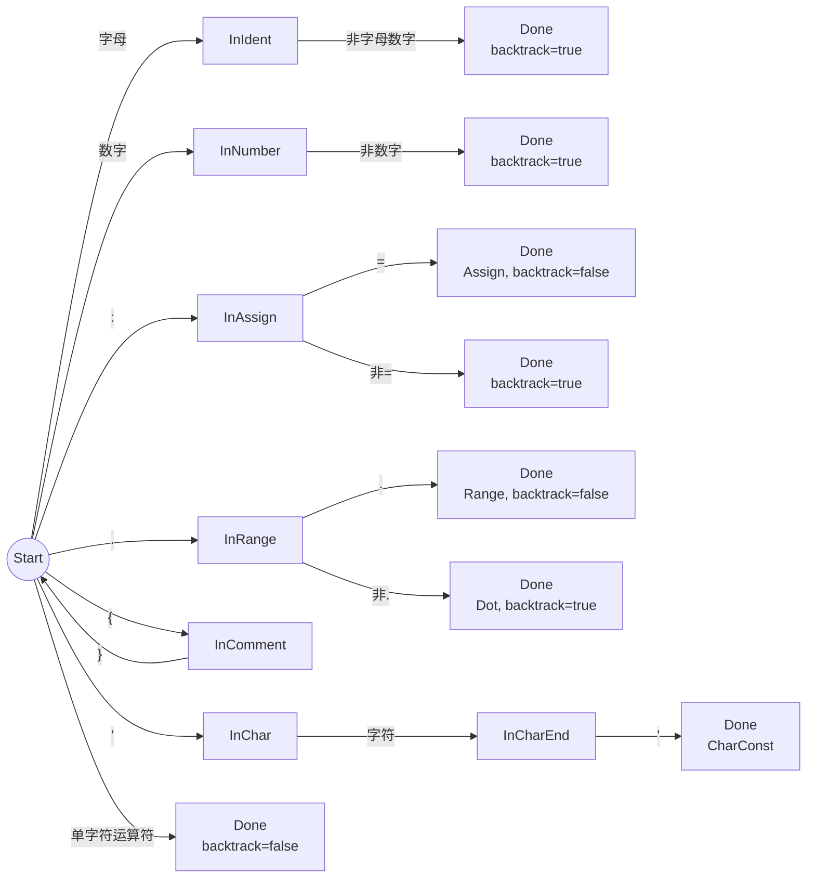
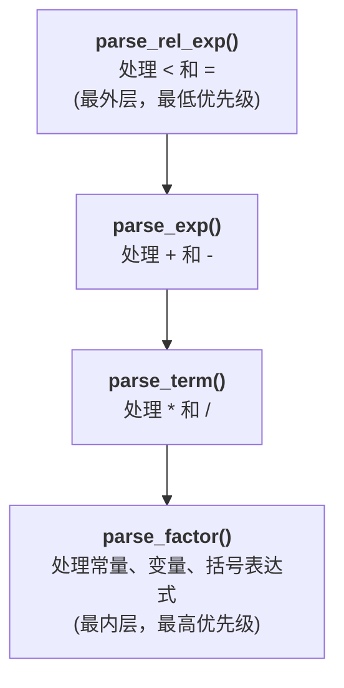
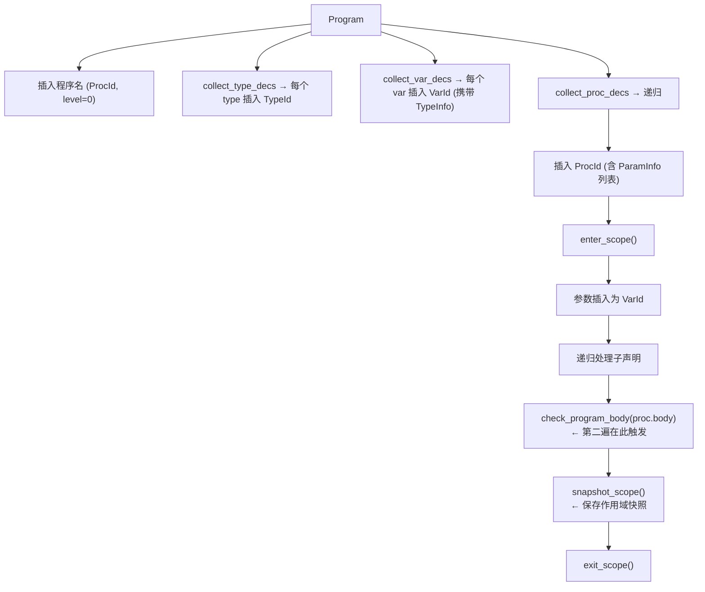

# SNL 编译器关键技术详解

## 目录

- [1. 词法分析模块](#1-词法分析模块)
- [2. 语法分析模块](#2-语法分析模块)
- [3. 语义分析模块](#3-语义分析模块)
- [4. 代码生成模块](#4-代码生成模块)
- [5. 主程序与诊断输出](#5-主程序与诊断输出)

---

## 1. 词法分析模块

### 1.1 架构概述

词法分析器位于 `src/lexer/`，由四个文件组成：

| 文件 | 职责 |
|------|------|
| `token.rs` | Token 类型定义 |
| `keyword.rs` | 关键字二分查找表 |
| `dfa.rs` | DFA 状态机 |
| `mod.rs` | Lexer 驱动与主扫描循环 |

### 1.2 TokenKind 枚举

`TokenKind` 共 29 个变体：

**关键字（21 个）：** `Program`, `Type`, `Var`, `Procedure`, `Begin`, `End`, `Integer`, `Char`, `Array`, `Record`, `Of`, `While`, `Do`, `EndWh`, `If`, `Then`, `Else`, `Fi`, `Return`, `Read`, `Write`

**多字符运算符（2 个）：** `Assign` (`:=`), `Range` (`..`)

**单字符运算符与分隔符（13 个）：** `Plus`, `Minus`, `Times`, `Divide`, `LParent`, `RParent`, `LBracket`, `RBracket`, `Semicolon`, `Dot`, `Comma`, `Less`, `Equal`

**字面量（3 个，携带数据）：** `Ident(String)`, `IntConst(i64)`, `CharConst(char)`

**特殊（1 个）：** `Eof`

### 1.3 DFA 状态机

DFA 使用 **最长匹配策略**，通过回溯实现单字符前瞻。核心状态：



**关键实现 —— `backtrack` 标志：**

```rust
// dfa.rs - DfaResult 结构体
struct DfaResult {
    kind: TokenKind,
    line: usize,
    col: usize,
    backtrack: bool,  // 核心: 当前字符是否属于下一单词
}
```

当 DFA 遇到不属于当前词素的终止字符时（如数字后跟非数字），设置 `backtrack: true`，主循环不会前进字符索引，因此该字符将作为下一个 Token 的起始重新扫描。对于双字符运算符（`:=`, `..`），第二个字符被消费，设置 `backtrack: false`。

### 1.4 主扫描循环

```rust
// mod.rs - Lexer::tokenize() 简化流程
fn tokenize(&mut self, source: &str) -> (&[Token], &[LexerError]) {
    let chars: Vec<char> = source.chars().collect();
    let mut dfa = Dfa::new(1, 1);
    let mut i = 0;

    while i < chars.len() {
        let ch = chars[i];

        // 空白字符快速路径：在 Start 状态下直接跳过
        if dfa.state == DfaState::Start && ch.is_whitespace() {
            if ch == '\n' { line += 1; col = 1; }
            else { col += 1; }
            i += 1;
            continue;
        }

        // DFA 状态转移
        if let Some(result) = dfa.advance(ch) {
            self.tokens.push(Token { kind: result.kind, ... });
            dfa.reset(line, col);

            // 回溯：不前进字符索引
            if !result.backtrack {
                i += 1;
                col += 1;
            }
        } else {
            i += 1;
            col += 1;
            // 注释内换行仍追踪行号
            if ch == '\n' && dfa.state == DfaState::InComment { ... }
        }
    }

    // EOF 刷新：处理未闭合的注释/字符常量
    match dfa.state {
        DfaState::InComment =>
            self.errors.push(LexerError { msg: "Unterminated comment", ... }),
        DfaState::InChar | DfaState::InCharEnd =>
            self.errors.push(LexerError { msg: "Unterminated character literal", ... }),
        _ => { /* 调用 dfa.finish() 处理残留的标识符/数字 */ }
    }

    self.tokens.push(Token { kind: TokenKind::Eof, ... });
    (&self.tokens, &self.errors)
}
```

### 1.5 关键字查找

```rust
// keyword.rs
const KEYWORDS: &[(&str, TokenKind)] = &[
    ("array",    TokenKind::Array),
    ("begin",    TokenKind::Begin),
    // ... 共 21 个，按字母排序 ...
    ("write",    TokenKind::Write),
];

pub fn lookup_keyword(ident: &str) -> TokenKind {
    let lower = ident.to_lowercase();  // 大小写不敏感
    KEYWORDS
        .binary_search_by(|(kw, _)| kw.cmp(&lower.as_str()))
        .map(|i| KEYWORDS[i].1.clone())
        .unwrap_or_else(|_| TokenKind::Ident(ident.to_string()))
}
```

**要点：**
- 二分查找，O(log 21) ≈ 常数时间
- 先转换为小写，关键字大小写不敏感
- 未命中时返回 `Ident`，保留原始大小写

### 1.6 边界情况处理

| 情况 | 处理方式 |
|------|---------|
| 单独的 `:` 不构成 `:=` | DFA 仍返回 Assign，EOF 时 `finish()` 返回 None，被静默丢弃 |
| `'ab'` 内多字符 | 只取首字符生成 CharConst，多余字符回溯重扫 |
| 未闭合的 `'` | EOF 时报告 "Unterminated character literal" |
| 未闭合的 `{` | EOF 时报告 "Unterminated comment" |
| 多行注释 | DFA 内追踪换行以保持行号 |
| 下划线 `_` | 不属于标识符字符集，被当作分隔符 |

---

## 2. 语法分析模块

### 2.1 架构概述

项目实现**两套**语法分析器：

| 分析器 | 文件 | 功能 |
|--------|------|------|
| 递归下降 (RD) | `rd.rs` | 构建完整 AST，恐慌模式错误恢复 |
| LL(1) 表驱动 | `ll1.rs` + `grammar.rs` + `first_follow.rs` + `parse_table.rs` | 接受/拒绝验证，不构建 AST |

两者共享 `grammar.rs` 中定义的文法。

### 2.2 递归下降分析器 —— 表达式优先级爬升

运算符优先级不是通过查表实现，而是通过**函数调用层次**编码：



**关键代码 —— 左递归消除模式：**

```rust
// rd.rs - parse_exp 和 parse_other_term
fn parse_exp(&mut self) -> Exp {
    let left = self.parse_term();       // 先解析更高优先级
    self.parse_other_term(left)         // 再处理当前级别运算符
}

fn parse_other_term(&mut self, left: Exp) -> Exp {
    let op = match self.peek_kind() {
        TokenKind::Plus  => { self.advance(); BinOp::Add }
        TokenKind::Minus => { self.advance(); BinOp::Sub }
        _ => return left,               // ε: 无运算符，直接返回
    };
    let right = self.parse_exp();       // 右递归实现左结合
    Exp::Binary { op, left: Box::new(left), right: Box::new(right), loc }
}
```

这种写法是经典**消除文法左递归后的递归下降实现**：
- `parse_term` 先解析乘除 → 乘除优先级高于加减
- `parse_other_term` 中的 `self.parse_exp()` 递归调用 → 实现左结合
- Factor 层的 `( Exp )` → 使括号可以提升任何子表达式的优先级

### 2.3 AssCall 左因子化

SNL 文法中 `Stm → ID AssCall` 和 `AssCall → AssignmentRest | CallStmRest` 存在冲突：消费 `ID` 后需要区分赋值还是过程调用。

```rust
// rd.rs - parse_ass_call (手动左因子化)
fn parse_ass_call(&mut self, name: String, loc: Loc) -> Stm {
    match self.peek_kind() {
        // 赋值路径: x := ... 或 x[...] := ... 或 x.field := ...
        TokenKind::Assign | TokenKind::LBracket | TokenKind::Dot => {
            self.parse_assignment_stm(name, loc)
        }
        // 过程调用路径: f(...)
        TokenKind::LParent => {
            self.parse_call_stm(name, loc)
        }
        _ => {
            self.error("Expected :=, [, ., or ( after identifier", loc);
            Stm::Read { var: name, loc }  // 哑元恢复
        }
    }
}
```

区分依据：
- `:=`、`[`、`.` → 赋值语句（变量后跟赋值符、数组下标或字段选择器）
- `(` → 过程调用语句（过程名后跟参数列表）

### 2.4 恐慌模式错误恢复

```rust
// rd.rs - sync 函数
fn sync(&mut self, sync_tokens: &[TokenKind]) {
    while !sync_tokens.contains(self.peek_kind())
          && !matches!(self.peek_kind(), TokenKind::Eof)
    {
        self.pos += 1;  // 跳过 token 直到同步符号
    }
}
```

同步符号集：`{Semicolon, End, Fi, EndWh, Else}` — 这些是语句和块的终止符，确保解析器能在自然边界重新同步。

### 2.5 LL(1) 分析器 —— FIRST/FOLLOW 不动点计算

```rust
// first_follow.rs - 不动点迭代算法
fn compute(grammar: &Grammar) -> (HashMap<NonTerm, HashSet<TokenKind>>, ...) {
    loop {
        let mut changed = false;

        // 计算 FIRST 集
        for prod in &grammar.productions {
            let rhs_first = first_of_string(&prod.rhs, &first);
            for tk in rhs_first {
                if first.get_mut(&prod.lhs).unwrap().insert(tk) {
                    changed = true;
                }
            }
        }

        // 计算 FOLLOW 集
        for prod in &grammar.productions {
            for i in 0..prod.rhs.len() {
                if let GrammarSymbol::N(nt) = &prod.rhs[i] {
                    let beta_first = first_of_string(&prod.rhs[i+1..], &first);
                    // 将 beta 的 FIRST(不含 EOF) 加入 FOLLOW(nt)
                    for tk in &beta_first {
                        if *tk != TokenKind::Eof
                           && follow.get_mut(nt).unwrap().insert(tk.clone()) {
                            changed = true;
                        }
                    }
                    // 若 beta 可空，将 FOLLOW(lhs) 加入 FOLLOW(nt)
                    if beta_first.contains(&TokenKind::Eof) {
                        let lhs_follow = follow[&prod.lhs].clone();
                        for tk in lhs_follow {
                            if follow.get_mut(nt).unwrap().insert(tk) {
                                changed = true;
                            }
                        }
                    }
                }
            }
        }

        if !changed { break; }  // 不再变化时退出
    }
}
```

### 2.6 LL(1) 分析表构建与冲突检测

```rust
// parse_table.rs
fn build_ll1_table(grammar: &Grammar) -> Result<Ll1Table, Vec<Conflict>> {
    let (first, follow) = FirstFollow::compute(grammar);
    let mut entries = HashMap::new();
    let mut conflicts = Vec::new();

    for (i, prod) in grammar.productions.iter().enumerate() {
        let predict = predict_set(prod, &first, &follow);
        for tk in predict {
            if tk == TokenKind::Eof { continue; }
            let key = (prod.lhs, tk);
            if let Some(&existing) = entries.get(&key) {
                conflicts.push(Conflict { nt: prod.lhs, token: tk, prod1: existing, prod2: i });
            } else {
                entries.insert(key, i);
            }
        }
    }

    if conflicts.is_empty() { Ok(Ll1Table { entries }) }
    else { Err(conflicts) }
}
```

### 2.7 LL(1) 表驱动解析

```rust
// ll1.rs - 表驱动解析主循环
fn parse(&mut self) -> bool {
    let mut stack = vec![self.grammar.start];
    while let Some(top) = stack.pop() {
        match top {
            GrammarSymbol::T(expected) => {
                if !self.token_matches(&expected, &self.current_token().kind) {
                    self.error("Token mismatch", ...);
                    self.pos += 1;
                } else {
                    self.pos += 1;
                }
            }
            GrammarSymbol::N(nt) => {
                let normalized = normalize(&self.current_token().kind);
                if let Some(&prod_idx) = self.table.entries.get(&(nt, normalized)) {
                    let rhs = &self.grammar.productions[prod_idx].rhs;
                    // 逆序压栈：使第一个符号在栈顶
                    for sym in rhs.iter().rev() {
                        stack.push(*sym);
                    }
                } else {
                    self.error("No rule", ...);
                    self.pos += 1;
                }
            }
        }
    }
    self.errors.is_empty()
}
```

---

## 3. 语义分析模块

### 3.1 符号表 —— 嵌套作用域栈

```rust
// symbol.rs
pub struct SymbolTable {
    scopes: Vec<HashMap<String, SymbolEntry>>,
}
```

作用域通过 `Vec` 管理，索引 0 为全局作用域：

```
enter_scope():  scopes.push(HashMap::new())     // 进入过程时
exit_scope():   scopes.pop()                    // 离开过程时
lookup(name):   scopes.iter().rev() 中查找      // 从内向外
```

**词法作用域查找：**

```rust
pub fn lookup(&self, name: &str) -> Option<&SymbolEntry> {
    for scope in self.scopes.iter().rev() {  // 从最内层开始
        if let Some(entry) = scope.get(name) {
            return Some(entry);
        }
    }
    None
}
```

### 3.2 TypeInfo —— 内部类型表示

```rust
pub enum TypeInfo {
    Integer,                               // 整型
    Char,                                  // 字符型
    Array(Box<TypeInfo>, i64, i64),        // 数组(元素类型, 下界, 上界)
    Record(Vec<FieldInfo>),                // 记录(字段列表)
    Named(String),                         // 未解析的命名类型引用
}
```

与 AST 中 `TypeDesig` 的区别：`TypeInfo::Named` 在类型别名引用时延迟解析——`type_desig_to_info` 将 `Named` 原样保留，在 `resolve_selector` 和 `types_compatible` 中按名称匹配。

### 3.3 两遍分析

**第一遍：符号表构建 (`collect_declarations`)**



**第二遍：语句检查 (`check_program_body`)**

对每个语句调用 `check_stm`：
- **Assign**: 验证 LHS 是变量 (错误7)，类型兼容 (错误6)
- **If/While**: 条件必须是整型 (错误11)
- **Read**: 变量必须已声明且为 VarId (错误2, 3)
- **Call**: 过程已声明 (错误2, 10)，参数数量和类型匹配 (错误8, 9)
- **Binary**: 左右操作数类型兼容 (错误12)

### 3.4 类型兼容性检查

```rust
fn types_compatible(a: &TypeInfo, b: &TypeInfo) -> bool {
    match (a, b) {
        (TypeInfo::Integer, TypeInfo::Integer) => true,
        (TypeInfo::Char, TypeInfo::Char) => true,
        (TypeInfo::Array(e1, l1, h1), TypeInfo::Array(e2, l2, h2)) =>
            l1 == l2 && h1 == h2 && types_compatible(e1, e2),
        (TypeInfo::Record(f1), TypeInfo::Record(f2)) =>
            f1.len() == f2.len()
                && f1.iter().zip(f2.iter())
                     .all(|(a, b)| a.name == b.name
                                   && types_compatible(&a.typ, &b.typ)),
        (TypeInfo::Named(n1), TypeInfo::Named(n2)) => n1 == n2,
        _ => false,
    }
}
```

结构等价：数组需要相同边界和元素类型；记录需要相同字段名和字段类型。命名类型按名称比较。

### 3.5 选择器解析

```rust
fn resolve_selector(&mut self, ty: &TypeInfo, sel: &Selector) -> Option<TypeInfo> {
    match ty {
        TypeInfo::Array(elem, low, high) => match sel {
            Selector::ArraySubscript(exp) => {
                // 常量下标: 检查 low..high 范围 (错误4)
                if let Exp::IntConst(n, loc) = exp.as_ref() {
                    if *n < *low || *n > *high { /* 错误4 */ }
                }
                Some(*elem.clone())     // 返回元素类型
            }
            _ => { /* 错误5: 数组上出现字段访问 */ None }
        },
        TypeInfo::Record(fields) => match sel {
            Selector::Field(name) | Selector::FieldSubscript(name, _) => {
                match fields.iter().find(|f| f.name == *name) {
                    Some(f) => {
                        // FieldSubscript 还需验证字段类型是 Array
                        if let Selector::FieldSubscript(_, exp) = sel { ... }
                        Some(f.typ.clone())
                    }
                    None => { /* 错误5: 字段未找到 */ None }
                }
            }
            _ => None,
        },
        _ => None,
    }
}
```

### 3.6 作用域快照机制

```rust
// 每次 exit_scope() 前调用
fn snapshot_scope(&mut self) {
    let level = self.symbols.current_level();
    let scope = self.symbols.scopes().last().unwrap().clone();  // 深拷贝
    self.scope_snapshots.push((level, scope));
}
```

这样即使分析结束后作用域已弹出，`main.rs` 仍可从 `scope_snapshots` 生成完整的符号表诊断输出。

### 3.7 12 种语义错误

| 代码 | 枚举变体 | 触发条件 |
|------|---------|---------|
| 1 | `DuplicateId` | 同一作用域内重复声明 |
| 2 | `UndeclaredId` | 使用未声明标识符 |
| 3 | `WrongIdKind` | 将类型名当变量/过程用 |
| 4 | `ArraySubscriptRange` | 数组常量下标越界 |
| 5 | `InvalidArrayOrFieldRef` | 对非数组用下标、对非记录用 `.` |
| 6 | `AssignTypeMismatch` | 赋值左右类型不兼容 |
| 7 | `AssignLhsNotVariable` | 对非变量赋值 |
| 8 | `ParamTypeMismatch` | 过程调用实参类型错误 |
| 9 | `ParamCountMismatch` | 过程调用参数数量错误 |
| 10 | `NotProcedure` | 调用非过程标识符 |
| 11 | `CondNotBool` | if/while 条件非整型 |
| 12 | `OperatorTypeMismatch` | 表达式运算符类型不匹配 |

---

## 4. 代码生成模块

### 4.1 CodegenType —— 代码生成内部类型

```rust
pub enum CodegenType {
    Integer,                              // 4 字节, lw/sw
    Char,                                 // 4 字节分配, lb/sb
    Array(Box<CodegenType>, i64, i64),    // count × elem_byte_size
    Record(Vec<(String, CodegenType)>),   // 扁平化字段列表, 含偏移计算
}
```

与语义分析的 `TypeInfo` 的区别：
- 没有 `Named` 变体 —— 所有类型别名在代码生成时**立即解析**
- `Record` 的字段是 `Vec<(String, CodegenType)>` 而非 `Vec<FieldInfo>`，多名称定义被展开为独立条目

**核心方法：**

```rust
impl CodegenType {
    fn size_of(&self) -> i32 {
        match self {
            Integer => 4,
            Char => 4,                          // 标量 char 字对齐
            Array(elem, low, high) => {
                let count = (high - low + 1) as i32;
                count * elem.element_byte_size()  // int: ×4, char: ×1
            }
            Record(fields) => fields.iter().map(|(_, t)| t.size_of()).sum(),
        }
    }

    fn element_byte_size(&self) -> i32 {
        match self {
            Integer => 4,    // 数组下标用 sll 乘4
            Char => 1,       // 数组下标不位移
            Array(elem, ..) => elem.element_byte_size(),
            Record(_) => panic!("Record has no element byte size"),
        }
    }

    fn field_offsets(&self) -> HashMap<String, (i32, CodegenType)> {
        let mut offsets = HashMap::new();
        if let Record(fields) = self {
            let mut offset = 0i32;
            for (name, ft) in fields {
                offsets.insert(name.clone(), (offset, ft.clone()));
                offset += ft.size_of();
            }
        }
        offsets
    }
}
```

### 4.2 类型别名解析

代码生成器从 AST 直接推导类型，不依赖语义分析器（其作用域已在分析完成后弹出）：

```rust
// 构建别名映射
fn build_type_alias_map(type_dec: &TypeDec) -> HashMap<String, TypeBody> {
    let mut aliases = HashMap::new();
    if let TypeDec::Defined(defs) = type_dec {
        for def in defs {
            aliases.insert(def.name.clone(), def.body.clone());
        }
    }
    aliases
}

// 解析 TypeDesig → CodegenType, 通过别名映射处理 Named
fn type_desig_to_codegen(td: &TypeDesig, aliases: &HashMap<String, TypeBody>) -> CodegenType {
    match td {
        TypeDesig::Base(BaseType::Integer) => CodegenType::Integer,
        TypeDesig::Base(BaseType::Char) => CodegenType::Char,
        TypeDesig::Array(arr) => { /* 构建 Array */ }
        TypeDesig::Record(rec) => { /* 展开多名称字段, 构建 Record */ }
        TypeDesig::Named(name) => {
            let body = aliases.get(name)
                .unwrap_or_else(|| panic!("Undefined type alias: {}", name));
            type_body_to_codegen(body, aliases, &mut vec![name.clone()])
            // visited 向量检测循环别名
        }
    }
}
```

### 4.3 MipsContext —— 作用域感知状态

```rust
pub struct MipsContext {
    pub code: String,                              // .text 段
    pub data: String,                              // .data 段
    label_counter: usize,                          // 唯一标签生成
    var_offsets: Vec<HashMap<String, (i32, usize)>>,  // (偏移量, 嵌套级别)
    var_types: Vec<HashMap<String, CodegenType>>,     // 类型映射
    frame_sizes: Vec<i32>,                         // 每作用域帧大小
    nesting_level: usize,                          // 当前嵌套级别
}
```

**进入/退出过程：**

```rust
fn enter_proc(&mut self) {
    self.nesting_level += 1;
    self.var_offsets.push(HashMap::new());
    self.var_types.push(HashMap::new());
    self.frame_sizes.push(8);  // $fp + $ra 保存空间
}

fn exit_proc(&mut self) { /* 对称 pop */ }
```

**变量分配（类型感知）：**

```rust
fn alloc_var(&mut self, name: &str, typ: &CodegenType) {
    if !self.current_scope().contains_key(name) {
        let offset = *self.frame_sizes.last().unwrap();
        let level = self.nesting_level;
        self.current_scope_mut().insert(name.to_string(), (offset, level));
        self.var_types.last_mut().unwrap().insert(name.to_string(), typ.clone());
        *self.frame_sizes.last_mut().unwrap() += typ.size_of();  // 按类型分配
    }
}
```

### 4.4 MIPS 栈帧布局

```
main 栈帧:
  $fp → [保存的 $ra]        0($fp)
         [局部变量...]      -4($fp), -8($fp), ...

过程栈帧:
  $fp → [保存的旧 $fp]      0($fp)
         [保存的 $ra]        4($fp)
         [局部变量...]      -8($fp) 起
         参数 (调用者压入)   8($fp) = 参数1, 12($fp) = 参数2, ...
```

### 4.5 类型感知加载/存储

```rust
fn emit_load(ctx: &mut MipsContext, offset: i32, var_level: usize,
             name: &str, typ: &CodegenType) {
    let instr = if *typ == CodegenType::Char { "lb" } else { "lw" };
    if var_level == 0 {
        ctx.emit(&format!("  la $t8, var_{}", name));
        ctx.emit(&format!("  {} $v0, 0($t8)", instr));
    } else {
        ctx.emit(&format!("  {} $v0, {}", instr, fp_offset(offset)));
    }
}
```

全局变量使用 `la $t8, var_X` 加载地址，局部变量使用 `$fp` 相对寻址。Char 类型使用 `lb`/`sb` 进行字节存取。

### 4.6 emit_var_address —— 选择器地址计算

这是支持数组和记录字段访问的核心函数：

```rust
fn emit_var_address(va: &VarAccess, ctx: &mut MipsContext) -> CodegenType {
    let (offset, var_level) = ctx.get_var_offset(&va.base).unwrap();
    let current_typ = ctx.get_var_type(&va.base).unwrap();

    // 1. 加载基地址到 $t0
    if var_level == 0 {
        ctx.emit(&format!("  la $t0, var_{}", va.base));
    } else {
        ctx.emit(&format!("  addiu $t0, $fp, {}", -offset));
    }

    // 2. 遍历选择器链
    walk_selectors(&va.selector, ctx, current_typ)
}
```

**walk_selectors 逐选择器处理：**

```mermaid
flowchart TD
    subgraph AS["ArraySubscript(exp)"]
        AS1["1. push $t0 (保存基地址)"]
        AS2["2. compile_exp(exp) → $v0"]
        AS3["3. addiu $v0, $v0, -lo (减低下界)"]
        AS4["4. sll $v0, $v0, 2 (仅 int; char 不位移)"]
        AS5["5. pop $t0 (恢复基地址)"]
        AS6["6. addu $t0, $t0, $v0"]
        AS1 --> AS2 --> AS3 --> AS4 --> AS5 --> AS6
    end
    subgraph FLD["Field(name)"]
        FLD1["1. field_offsets() 查表 → (offset, type)"]
        FLD2["2. addiu $t0, $t0, field_offset"]
        FLD1 --> FLD2
    end
    subgraph FS["FieldSubscript(name, exp)"]
        FS1["1. addiu $t0, $t0, field_offset"]
        FS2["2. push $t0 + compile_exp(exp) + 减下界 + 乘元素大小 + pop $t0 + addu"]
        FS1 --> FS2
    end
```



**关键：`$t0` 冲突处理。** `compile_exp` 的 Binary 分支在弹栈时使用 `$t0` 作为临时寄存器，因此 `walk_selectors` 在调用 `compile_exp` 前必须保存 `$t0`：

```rust
// ArraySubscript 和 FieldSubscript 中的保护：
ctx.emit("  addiu $sp, $sp, -4");
ctx.emit("  sw $t0, 0($sp)          # save base address");
compile_exp(exp, ctx);              // 可能破坏 $t0
// ... 处理下标结果 ...
ctx.emit("  lw $t0, 0($sp)          # restore base address");
ctx.emit("  addiu $sp, $sp, 4");
```

### 4.7 表达式编译 —— 返回类型

```rust
fn compile_exp(exp: &Exp, ctx: &mut MipsContext) -> CodegenType {
    match exp {
        Exp::Binary { op, left, right, .. } => {
            // 先右后左，中间值压栈，$t0 弹栈
            compile_exp(right, ctx);
            ctx.emit("  addiu $sp, $sp, -4");
            ctx.emit("  sw $v0, 0($sp)");
            compile_exp(left, ctx);
            ctx.emit("  lw $t0, 0($sp)");
            ctx.emit("  addiu $sp, $sp, 4");
            // 运算: addu/subu/mul/div/slt/beq+li
            CodegenType::Integer  // 二元运算结果总是整型
        }
        Exp::IntConst(n, _) => {
            ctx.emit(&format!("  li $v0, {}", n));
            CodegenType::Integer
        }
        Exp::CharConst(c, _) => {
            ctx.emit(&format!("  li $v0, {}", *c as i32));
            CodegenType::Char
        }
        Exp::Variable(va, _) => {
            if va.selector.is_empty() {
                // 快速路径: 简单变量直接加载
                emit_load(ctx, offset, var_level, &va.base, &typ);
                typ
            } else {
                // 带选择器: 计算地址 → $t0 → 加载
                let final_typ = emit_var_address(va, ctx);
                if final_typ == CodegenType::Char {
                    ctx.emit("  lb $v0, 0($t0)");
                } else {
                    ctx.emit("  lw $v0, 0($t0)");
                }
                final_typ
            }
        }
    }
}
```

返回值用于上层语句（Write 选择 syscall 类型）。

### 4.8 语句编译

**Assign（含选择器支持）：**

```rust
Stm::Assign { lhs, rhs, .. } => {
    compile_exp(rhs, ctx);          // RHS → $v0
    if lhs.selector.is_empty() {
        emit_store(ctx, ..., typ);  // 简单变量直接存储
    } else {
        // 1. 保存 RHS 值到栈
        ctx.emit("  sw $v0, 0($sp)");
        // 2. 计算 LHS 地址 → $t0
        let lhs_type = emit_var_address(lhs, ctx);
        // 3. 恢复 RHS 值
        ctx.emit("  lw $v0, 0($sp)");
        // 4. 存储 (sb 或 sw)
        if lhs_type == CodegenType::Char { ctx.emit("  sb $v0, 0($t0)"); }
        else { ctx.emit("  sw $v0, 0($t0)"); }
    }
}
```

**Read/Write（类型感知 I/O）：**

```rust
Stm::Read { var, .. } => {
    let typ = ctx.get_var_type(var).unwrap_or(CodegenType::Integer);
    if typ == CodegenType::Char {
        ctx.emit("  li $v0, 12             # read char syscall");
    } else {
        ctx.emit("  li $v0, 5              # read int syscall");
    }
    ctx.emit("  syscall");
    emit_store(ctx, ..., &typ);
}

Stm::Write { exp, .. } => {
    let typ = compile_exp(exp, ctx);
    ctx.emit("  move $a0, $v0");
    if typ == CodegenType::Char {
        ctx.emit("  li $v0, 11             # print char syscall");
    } else {
        ctx.emit("  li $v0, 1              # print int syscall");
    }
    ctx.emit("  syscall");
    // 输出换行
    ctx.emit("  la $a0, newline");
    ctx.emit("  li $v0, 4");
    ctx.emit("  syscall");
}
```

**If/While（条件分支）：**

```rust
// If: beqz 跳 else, j 跳过 else 块
Stm::If { cond, then_branch, else_branch, .. } => {
    let else_label = ctx.new_label("else");
    let end_label = ctx.new_label("endif");
    compile_exp(cond, ctx);
    ctx.emit(&format!("  beqz $v0, {}", else_label));
    compile_stm_list(&then_branch.stmts, ctx);
    ctx.emit(&format!("  j {}", end_label));
    ctx.emit_label(&else_label);
    compile_stm_list(&else_branch.stmts, ctx);
    ctx.emit_label(&end_label);
}

// While: 循环标签 + beqz + j 回跳
Stm::While { cond, body, .. } => {
    let loop_label = ctx.new_label("loop");
    let end_label = ctx.new_label("endloop");
    ctx.emit_label(&loop_label);
    compile_exp(cond, ctx);
    ctx.emit(&format!("  beqz $v0, {}", end_label));
    compile_stm_list(&body.stmts, ctx);
    ctx.emit(&format!("  j {}", loop_label));
    ctx.emit_label(&end_label);
}
```

### 4.9 过程调用完整序列

```mermaid
sequenceDiagram
    participant Caller as 调用者
    participant Callee as 被调用者 (proc_X)

    Caller->>Caller: compile_exp(argN); addiu $sp, $sp, -4; sw $v0, 0($sp)
    Caller->>Caller: ...
    Caller->>Caller: compile_exp(arg1); addiu $sp, $sp, -4; sw $v0, 0($sp)
    Caller->>Callee: jal proc_X
    Callee->>Callee: addiu $sp, $sp, -8
    Callee->>Callee: sw $fp, 0($sp)
    Callee->>Callee: sw $ra, 4($sp)
    Callee->>Callee: move $fp, $sp
    Callee->>Callee: addiu $sp, $sp, -N (分配局部变量)
    Note over Callee: ... 过程体 ...
    Callee->>Callee: addiu $sp, $sp, N (释放局部变量)
    Callee->>Callee: lw $fp, 0($sp)
    Callee->>Callee: lw $ra, 4($sp)
    Callee->>Callee: addiu $sp, $sp, 8
    Callee->>Caller: jr $ra (返回)
    Caller->>Caller: addiu $sp, $sp, 4×N (弹出参数)
```

### 4.10 数据段对齐

数组和记录使用 `.space N` 分配，前面添加 `.align 2` 确保 4 字节对齐：

```rust
if size == 4 {
    ctx.emit_data(&format!("var_{}: .word 0", name));
} else {
    ctx.emit_data("  .align 2");
    ctx.emit_data(&format!("var_{}: .space {}", name, size));
}
```

这是从排序算法调试中发现的：`.space` 不自动对齐，导致后续 `.word` 可能位于未对齐地址，SPIM 触发 Address Error。

---

## 5. 主程序与诊断输出

### 5.1 编译流水线

```rust
// src/main.rs - 四阶段流水线
fn main() {
    let source = fs::read_to_string(input_path)?;

    // Phase 1: 词法分析 → token.md
    let (tokens, lex_errors) = lexer.tokenize(&source);
    fs::write(format!("{}_token.md", base_name), &format_token_md(...))?;
    if !lex_errors.is_empty() { process::exit(1); }

    // Phase 2: 语法分析 → tree.md
    let prog = parser.parse()?;
    fs::write(format!("{}_tree.md", base_name), &format_tree_md(...))?;

    // Phase 3: 语义分析 → table.md
    analyzer.analyze(&prog);
    fs::write(format!("{}_table.md", base_name), &format_table_md(...))?;
    if !semantic_errors.is_empty() { process::exit(1); }

    // Phase 4: 代码生成 → .asm
    let asm = mips::compile(&prog);
    fs::write(&output_path, &asm)?;
}
```

### 5.2 诊断输出文件

每次编译自动生成四个文件：

| 文件 | 内容 | 生成阶段 |
|------|------|---------|
| `*_token.md` | 单词序列表（序号/类型/值/行列）与词法错误 | 词法分析后 |
| `*_tree.md` | 抽象语法树层次化文本与语法错误 | 语法分析后 |
| `*_table.md` | 符号表（作用域结构/标识符/类型/参数）与语义错误 | 语义分析后 |
| `*.asm` | MIPS 汇编代码 | 代码生成后 |

### 5.3 错误处理策略

- **词法错误**：收集后立即退出（后续阶段无法处理）
- **语法错误**：收集但不阻止语义分析（AST 可能不完整）
- **语义错误**：收集后退出（代码生成需要正确的类型信息）

所有错误均报告行:列位置和描述信息。
